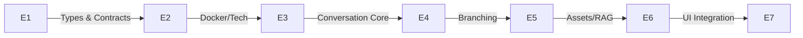

# Pipeline Documentation Strategy

## Pipeline Execution Diagram

## Implementation Execution
1. First complete E1 and E2 foundation setup
2. Execute E3 and E5 in parallel pipeline
3. Maintain pipeline independence
4. Verify synchronization points at E6 integration

## Code Execution Path
1. Initialize types in E1
2. Configure tech requirements in E2
3. Develop E3 core logic and E5 asset system simultaneously
4. Implement branching in E4
5. Integrate final components in E6
6. Handle web search extension in E7