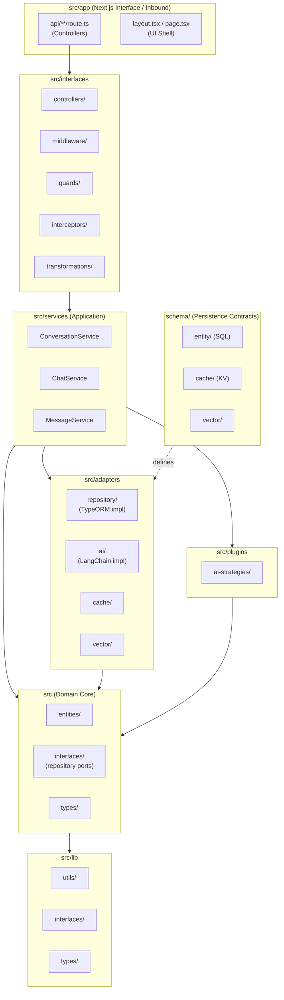
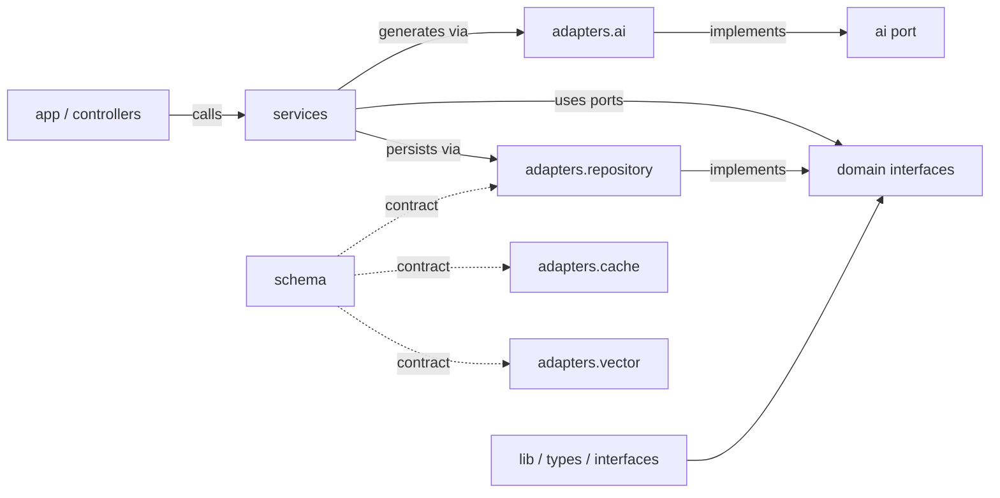

# Package Diagram — chaiGPT (Target Hexagonal Architecture)

Planned package structure. The **domain** package has zero framework imports. Adapters depend on the domain ports, never the reverse.

## Package Tree

## Package Dependencies (allowed direction)

