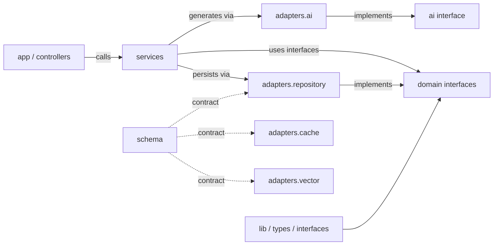

# Package Structure — chaiGPT (Target Hexagonal Architecture)

Planned layout for the hexagonal re-architecture. The **domain** (`src/domain`) is framework-free; everything else depends inward on domain interfaces, never the reverse. The architecture is segregated into **seven partitions**, each owning a distinct concern.

---

## 1. File Tree (authoritative)

Legend: `[I]` = domain interface (port) · `[A]` = outbound adapter (impl) · `[P]` = plugin (strategy) · `[E]` = entity · `[S]` = service · `[C]` = controller/route.


### Interface → Adapter → Plugin pairing

This is the segregation that prevents cross-linking: every adapter/plugin implements exactly one domain interface; nothing else references the concrete class.

| Domain interface `[I]` | Implemented by | Kind |
|------------------------|----------------|------|
| `IConversationRepository` | `adapters/repository/conversation.repository.ts` | [A] |
| `IMessageRepository` | `adapters/repository/message.repository.ts` | [A] |
| `IAssetRepository` | `adapters/repository/asset.repository.ts` | [A] |
| `IAiProvider` | `adapters/ai/langchain.provider.ts` | [A] |
| `ICacheInterface` | `adapters/cache/redis.cache.ts` | [A] |
| `IVectorInterface` | `adapters/vector/qdrant.vector.ts` | [A] |
| `IAiStrategy` | `plugins/ai-strategies/gpt-4o-mini.strategy.ts` | [P] |
| `IGuard` | `interfaces/guards/ClerkGuard` | inbound impl |
| `IInterceptor` | `interfaces/interceptors/*` | inbound impl |
| `ITransform` | `interfaces/transformations/*` | inbound impl |

> **Convention:** every port file is named `*.interface.ts` and lives under `src/interfaces/**`. Domain ports → `src/interfaces/domain/`, inbound ports → `src/interfaces/crosscutting/`. The `domain/` folder holds only entities + types.

---

## 2. Partitions (segregated by concern)

Each partition is isolated. Contents are listed per concern so nothing is interleaved.

### 2.1 Interfaces (Ports) — `src/interfaces`
*Holds every `*.interface.ts`. Domain ports + inbound ports. Nothing here is a concrete impl. Depends on: nothing (pure contracts).*

| Concern | Location | Contents |
|---------|----------|----------|
| Domain ports | `src/interfaces/domain` | `conversation.repository.interface.ts`, `message.repository.interface.ts`, `asset.repository.interface.ts`, `ai.provider.interface.ts`, `ai.strategy.interface.ts`, `cache.interface.ts`, `vector.interface.ts` |
| Inbound ports | `src/interfaces/crosscutting` | `guard.interface.ts` (`IGuard`), `interceptor.interface.ts` (`IInterceptor`), `transform.interface.ts` (`ITransform`) |
| Controllers | `src/interfaces/controllers` | route-handler wiring → services |
| Middleware | `src/interfaces/middleware` | Clerk session middleware |
| Guards (impl) | `src/interfaces/guards` | `ClerkGuard` impl of `IGuard` |
| Interceptors (impl) | `src/interfaces/interceptors` | impl of `IInterceptor` |
| Transformations (impl) | `src/interfaces/transformations` | impl of `ITransform` |

### 2.2 Application — `src/services`
*Orchestrates use-cases. Depends on: domain interfaces.*

| Concern | File | Responsibility |
|---------|------|----------------|
| Chat | `chat.service.ts` | send, stream, regenerate |
| Conversation | `conversation.service.ts` | list, create, getById, branch |
| Message | `message.service.ts` | append, edit-latest, status |
| Asset | `asset.service.ts` | ingest, remove |

### 2.3 Domain (Pure Core) — `src/domain`
*Framework-free. Entities + value types only — no ports (ports live in `src/interfaces`). Depends on: nothing.*

| Concern | Location | Contents |
|---------|----------|----------|
| Entities | `src/domain/entities` | `conversation.entity.ts`, `message.entity.ts`, `asset.entity.ts` |
| Types | `src/domain/types` | domain value types (`Role`, `Status`, …) |

### 2.4 Outbound / Adapters — `src/adapters`
*Implements domain interfaces against concrete tech. Depends on: domain interfaces.*

| Concern | Location | Implements |
|---------|----------|------------|
| Repository (Postgres) | `src/adapters/repository` | `conversation.repository.ts`, `message.repository.ts`, `asset.repository.ts` |
| AI (LangChain) | `src/adapters/ai` | `langchain.provider.ts` → `IAiProvider` |
| Cache (Redis) | `src/adapters/cache` | `redis.cache.ts` → `ICacheInterface` |
| Vector (Qdrant) | `src/adapters/vector` | `qdrant.vector.ts` → `IVectorInterface` |

### 2.5 Plugins — `src/plugins`
*Swappable strategy injection (Open/Closed). Depends on: domain interfaces.*

| Concern | Location | Implements |
|---------|----------|------------|
| AI strategies | `src/plugins/ai-strategies` | `gpt-4o-mini.strategy.ts` → `IAiStrategy` |

### 2.6 Lib / Shared — `src/lib`, `src/types`
*Framework-light shared utilities and types. Depends on: domain.*

| Concern | Location | Contents |
|---------|----------|----------|
| Utils | `src/lib/utils.ts` | shared helpers |
| Lib types | `src/lib/types` | shared DTOs |
| App types | `src/types` | global types (`ChatRequest`, `ChatResponse`) |

### 2.7 Persistence Schema — `schema/`
*SQL / KV / vector definitions consumed by adapters. Depends on: — (consumed, not imported).*

| Concern | Location | Defines |
|---------|----------|---------|
| Entity (SQL) | `schema/entity` | Postgres / TypeORM migrations |
| Cache (KV) | `schema/cache` | key-value store schema |
| Vector | `schema/vector` | Qdrant collection schema |

---

## 3. Dependency Rule

Arrows point **inward only**:

```
app → interfaces → services → domain interfaces
adapters ──implement──▶ domain interfaces
plugins  ──implement──▶ domain interfaces
```

The domain never imports Next, TypeORM, LangChain, Redis, or Qdrant. Cross-partition references always go through a domain interface, never a concrete adapter.

---

## 4. Allowed Dependency Directions


