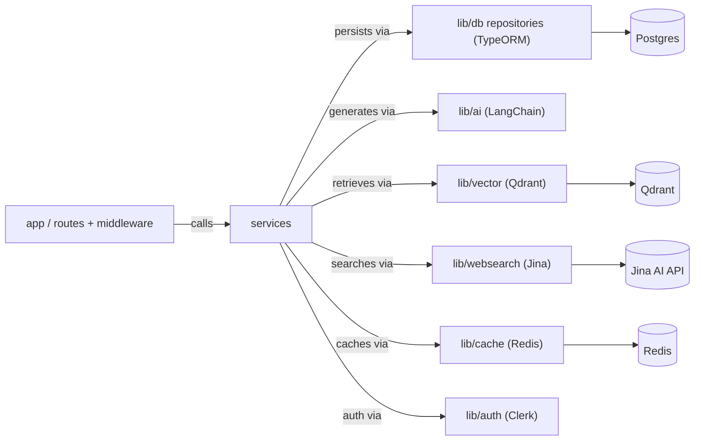

# Package Structure — chaiGPT (Layered, Next.js + TypeORM)

Tightly integrated with **Next.js (App Router, route handlers, middleware)** and **TypeORM (entities, migrations, repositories)**. Separation is by *concern* (routes → services → entities/repositories → integrations), not by framework isolation. Coupling to Next.js and TypeORM is approved and intentional.

---

## 1. File Tree (authoritative)

Legend: `[E]` = entity · `[S]` = service · `[R]` = repository · `[C]` = route handler · `[M]` = middleware · `[I]` = integration (LangChain/Qdrant/cache).


---

## 2. Partitions (segregated by concern)

### 2.1 Routes — `src/app`
*Next.js App Router entry points. Clerk middleware guards; route handlers call services. Depends on: services, `lib/auth`.*

| Concern | Location | Contents |
|---------|----------|----------|
| Chat route | `src/app/api/chat/route.ts` | SSE stream → `ChatService` |
| Conversations routes | `src/app/api/conversations/**` | list/create/getById → `ConversationService` |
| Assets route | `src/app/api/assets/route.ts` | upload/delete → `AssetService` |
| Middleware | `src/app/middleware.ts` | Clerk session protection |
| UI shell | `src/app/layout.tsx`, `page.tsx` | chat UI |

### 2.2 Services — `src/services`
*Use-case orchestration. Depends on: `lib/db` repositories, `lib/ai`, `lib/vector`, `lib/cache`.*

| Concern | File | Responsibility |
|---------|------|----------------|
| Chat | `chat.service.ts` | send, stream, regenerate |
| Conversation | `conversation.service.ts` | list, create, getById, branch |
| Message | `message.service.ts` | append, edit-latest, status |
| Asset | `asset.service.ts` | ingest, remove |

### 2.3 Data (TypeORM) — `src/lib/db`
*Entities + repositories + migrations. Depends on: nothing (pure persistence).*

| Concern | Location | Contents |
|---------|----------|----------|
| Entities | `src/lib/db/entities` | `conversation.entity.ts`, `message.entity.ts`, `asset.entity.ts` |
| Repositories | `src/lib/db/repositories` | `conversation/message/asset.repository.ts` |
| Migrations | `src/lib/db/migrations` | TypeORM SQL migrations |
| DataSource | `src/lib/db/data-source.ts` | Postgres connection |

### 2.4 Integrations — `src/lib/{ai,vector,websearch,cache,auth}`
*External systems used directly (no port indirection). Depends on: services call them.*

| Concern | Location | Tech |
|---------|----------|------|
| AI | `src/lib/ai/langchain.ts` | LangChain `ChatOpenAI` (stream) |
| Vector | `src/lib/vector/qdrant.ts` | Qdrant via `@langchain/qdrant` |
| Web Search | `src/lib/websearch/jina.ts`, `websearch/webSearchTool.ts` | Jina AI search client + LangChain tool (FR-24, FR-27) |
| Cache | `src/lib/cache/redis.ts` | Redis KV |
| Auth | `src/lib/auth/session.ts` | Clerk `auth()` |

### 2.5 Shared — `src/lib`, `src/types`
| Concern | Location | Contents |
|---------|----------|----------|
| Validation | `src/lib/validation/schemas.ts` | Zod schemas |
| Utils | `src/lib/utils.ts` | helpers |
| App types | `src/types` | `ChatRequest`, `ChatResponse` |

### 2.6 Tests — `tests/`, `e2e/`
*Unit tests colocated with source (`*.test.ts`); shared fixtures in `tests/fixtures/`. Playwright e2e in `e2e/*.spec.ts` against Docker Compose.*

| Concern | Location | Tech |
|---------|----------|------|
| Unit | `src/**/*.test.ts`, `tests/unit/` | Vitest (FR-29..FR-31) |
| Fixtures | `tests/fixtures/` | MockJinaProvider, MockQdrantStore, MockAiProvider |
| E2E | `e2e/*.spec.ts` | Playwright, Docker Compose (Postgres + Qdrant) (FR-32..FR-34) |

### 2.6 Persistence Schema — `schema/`
| Concern | Location | Defines |
|---------|----------|---------|
| Entity (SQL) | `schema/entity` | Postgres / TypeORM migrations |
| Cache (KV) | `schema/cache` | key-value store schema |
| Vector | `schema/vector` | Qdrant collection schema |

---

## 3. Dependency Rule

Arrows point **inward to services**, then down to repositories/integrations:

```
app (routes + middleware) → services → { repositories (TypeORM) | ai | vector | websearch | cache }
```

Next.js and TypeORM are used directly throughout — there is **no port/adapter abstraction layer** to decouple them. Cross-cutting auth is handled by Next.js middleware + `auth()` in route handlers.

---

## 4. Allowed Dependency Directions


