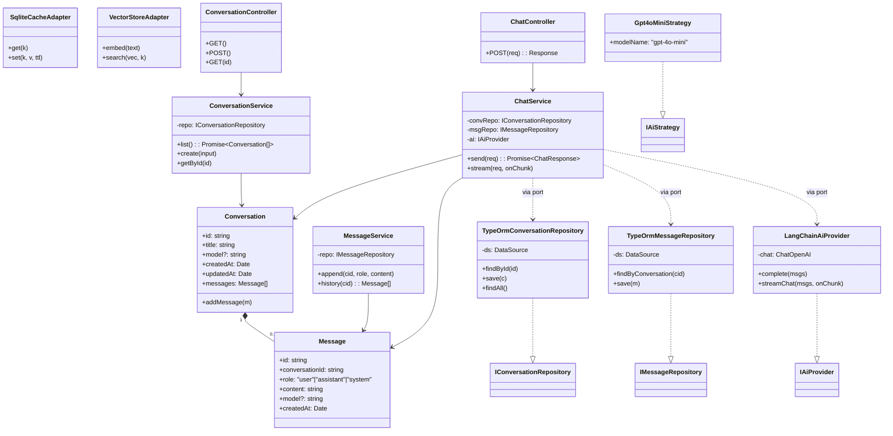

# Class Diagram — chaiGPT (by Separation of Concern)

Two views: **(A) Concrete classes** grouped by layer, **(B) Interfaces + Types** (the ports/contracts) grouped by layer. The dependency rule: outer layers reference inner layers only through interfaces.

## A) Concrete Classes

## B) Interfaces & Types (Ports + Contracts)

```mermaid
classDiagram
    %% Repository ports (domain interfaces)
    class IConversationRepository {
        <<interface>>
        +findById(id): Promise~Conversation|null~
        +save(c): Promise~Conversation~
        +findAll(): Promise~Conversation[]~
    }
    class IMessageRepository {
        <<interface>>
        +findByConversation(cid): Promise~Message[]~
        +save(m): Promise~Message~
    }
    %% AI port + strategy
    class IAiProvider {
        <<interface>>
        +complete(msgs): Promise~string~
        +streamChat(msgs, onChunk?): AsyncGenerator~string~
    }
    class IAiStrategy {
        <<interface>>
        +modelName: string
        +build(messages): LangChainMessage[]
    }
    %% Cache / vector ports
    class ICachePort {
        <<interface>>
        +get(k): Promise~string|null~
        +set(k, v, ttl): Promise~void~
    }
    class IVectorPort {
        <<interface>>
        +embed(text): Promise~number[]~
        +search(vec, k): Promise~Hit[]~
    }
    %% Cross-cutting ports
    class IGuard {
        <<interface>>
        +canActivate(ctx): Promise~boolean~
    }
    class IInterceptor {
        <<interface>>
        +intercept(ctx, next): Promise~Response~
    }
    class ITransform {
        <<interface>>
        +toDto(entity): Dto
        +toEntity(dto): Entity
    }

    %% Shared types
    class ChatRequest {
        <<type>>
        +messages: Role content[]
        +model?: string
        +conversationId?: string
    }
    class ChatResponse {
        <<type>>
        +id: string
        +content: string
        +conversationId: string
        +model?: string
    }
    class Role {
        <<type>>
        +"user"|"assistant"|"system"
    }

    IConversationRepository <|.. TypeOrmConversationRepository
    IMessageRepository <|.. TypeOrmMessageRepository
    IAiProvider <|.. LangChainAiProvider
    IAiStrategy <|.. Gpt4oMiniStrategy
    ICachePort <|.. SqliteCacheAdapter
    IVectorPort <|.. VectorStoreAdapter
```

