# Class Diagram — chaiGPT (by Separation of Concern, v2)

Two views: **(A) Concrete classes** grouped by layer, **(B) Interfaces + Types** (the interfaces/contracts) grouped by layer. The dependency rule: outer layers reference inner layers only through interfaces. Reflects the PRD §9 v2 model (auth, branching, assets, Postgres, Qdrant).

## A) Concrete Classes

```mermaid
classDiagram
    %% Domain entities
    class Conversation {
        +id: string
        +userId: string
        +rootConversationId?: string
        +lastMessageId?: string
        +title: string
        +model?: string
        +createdAt: Date
        +updatedAt: Date
        +addMessage(content, role): Message
        +branchFrom(messageId): Conversation
    }
    class Message {
        +id: string
        +conversationId: string
        +userId: string
        +parentId?: string
        +role: "user"|"assistant"|"system"
        +content: string
        +model?: string
        +status: "processing"|"complete"|"stopped"
        +createdAt: Date
        +regenerate(): void
    }
    class Asset {
        +id: string
        +userId: string
        +conversationId: string
        +filename: string
        +mime: string
        +path: string
        +createdAt: Date
    }

    %% Application services
    class ChatService {
        -convRepo: IConversationRepository
        -msgRepo: IMessageRepository
        -ai: IAiProvider
        -vector: IVectorInterface
        -cache: ICacheInterface
        +send(req): Promise~ChatResponse~
        +stream(req, onChunk)
        +regenerate(messageId)
    }
    class ConversationService {
        -repo: IConversationRepository
        +list(userId): Promise~Conversation[]~
        +create(userId, input)
        +getById(id, userId)
        +branch(id, messageId)
    }
    class MessageService {
        -repo: IMessageRepository
        +append(cid, role, content)
        +history(cid): Message[]
        +editLatest(userId, cid, content)
    }
    class AssetService {
        -assetRepo: IAssetRepository
        -vector: IVectorInterface
        +ingest(userId, convId, file): Promise~Asset~
        +remove(assetId, userId)
    }

    %% Adapters
    class PostgresConversationRepository {
        -ds: DataSource
        +findById(id, userId)
        +save(c)
        +findAll(userId)
        +branch(...)
    }
    class PostgresMessageRepository {
        -ds: DataSource
        +findByConversation(cid)
        +save(m)
        +updateStatus(id, status)
    }
    class PostgresAssetRepository {
        -ds: DataSource
        +save(a)
        +findByConversation(cid)
        +delete(id)
    }
    class LangChainAiProvider {
        -chat: ChatOpenAI
        +complete(msgs)
        +streamChat(msgs, onChunk)
    }
    class QdrantVectorAdapter {
        +embed(text): Promise~number[]~
        +search(vec, convId, k): Promise~Hit[]~
        +upsertChunks(assetId, chunks)
    }
    class RedisCacheAdapter {
        +get(k)
        +set(k, v, ttl)
    }

    %% Framework interface (inbound)
    class ChatController {
        +POST(req): Response
    }
    class ConversationController {
        +GET()
        +POST()
        +GET(id)
    }
    class AssetController {
        +POST(upload)
        +DELETE(id)
    }
    class ClerkGuard {
        +canActivate(ctx): Promise~boolean~
    }

    %% Plugins
    class Gpt4oMiniStrategy {
        +modelName: "gpt-4o-mini"
    }

    Conversation "1" *-- "0..*" Message
    Conversation "1" *-- "0..*" Asset
    Message "0..1" *-- "0..*" Message : "parent of"

    ChatService --> Conversation
    ChatService --> Message
    ConversationService --> Conversation
    MessageService --> Message
    AssetService --> Asset
    ChatService ..> PostgresConversationRepository : via interface
    ChatService ..> PostgresMessageRepository : via interface
    ChatService ..> LangChainAiProvider : via interface
    ChatService ..> QdrantVectorAdapter : via interface
    ChatService ..> RedisCacheAdapter : via interface
    AssetService ..> PostgresAssetRepository : via interface
    AssetService ..> QdrantVectorAdapter : via interface
    PostgresConversationRepository ..|> IConversationRepository
    PostgresMessageRepository ..|> IMessageRepository
    PostgresAssetRepository ..|> IAssetRepository
    LangChainAiProvider ..|> IAiProvider
    QdrantVectorAdapter ..|> IVectorInterface
    RedisCacheAdapter ..|> ICacheInterface
    ClerkGuard ..|> IGuard
    Gpt4oMiniStrategy ..|> IAiStrategy
    ChatController --> ChatService
    ConversationController --> ConversationService
    AssetController --> AssetService
    ChatController --> ClerkGuard
```

## B) Interfaces & Types (Interfaces + Contracts)

```mermaid
classDiagram
    %% Repository interfaces (domain contracts)
    class IConversationRepository {
        <<interface>>
        +findById(id, userId): Promise~Conversation|null~
        +save(c): Promise~Conversation~
        +findAll(userId): Promise~Conversation[]~
        +branch(id, messageId): Promise~Conversation~
    }
    class IMessageRepository {
        <<interface>>
        +findByConversation(cid): Promise~Message[]~
        +save(m): Promise~Message~
        +updateStatus(id, status): Promise~void~
    }
    class IAssetRepository {
        <<interface>>
        +save(a): Promise~Asset~
        +findByConversation(cid): Promise~Asset[]~
        +delete(id): Promise~void~
    }
    %% AI interface + strategy
    class IAiProvider {
        <<interface>>
        +complete(msgs): Promise~string~
        +streamChat(msgs, onChunk?): AsyncGenerator~string~
    }
    class IAiStrategy {
        <<interface>>
        +modelName: string
        +build(messages): LangChainMessage[]
    }
    %% Cache / vector interfaces
    class ICacheInterface {
        <<interface>>
        +get(k): Promise~string|null~
        +set(k, v, ttl): Promise~void~
    }
    class IVectorInterface {
        <<interface>>
        +embed(text): Promise~number[]~
        +search(vec, convId, k): Promise~Hit[]~
        +upsertChunks(assetId, chunks): Promise~void~
    }
    %% Cross-cutting interfaces
    class IGuard {
        <<interface>>
        +canActivate(ctx): Promise~boolean~
    }
    class IInterceptor {
        <<interface>>
        +intercept(ctx, next): Promise~Response~
    }
    class ITransform {
        <<interface>>
        +toDto(entity): Dto
        +toEntity(dto): Entity
    }

    %% Shared types
    class ChatRequest {
        <<type>>
        +messages: Role content[]
        +model?: string
        +conversationId?: string
    }
    class ChatResponse {
        <<type>>
        +id: string
        +content: string
        +conversationId: string
        +model?: string
    }
    class Role {
        <<type>>
        +"user"|"assistant"|"system"
    }

    IConversationRepository <|.. PostgresConversationRepository
    IMessageRepository <|.. PostgresMessageRepository
    IAssetRepository <|.. PostgresAssetRepository
    IAiProvider <|.. LangChainAiProvider
    IAiStrategy <|.. Gpt4oMiniStrategy
    ICacheInterface <|.. RedisCacheAdapter
    IVectorInterface <|.. QdrantVectorAdapter
    IGuard <|.. ClerkGuard
```

