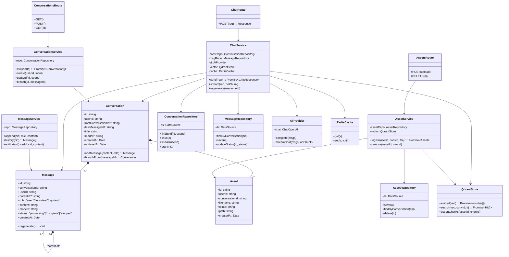
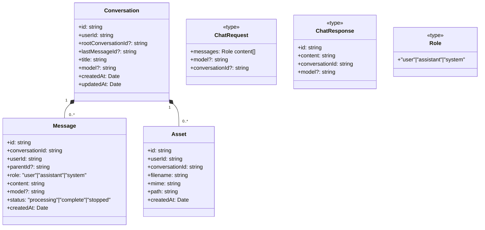

# Class Diagram — chaiGPT (Layered, Next.js + TypeORM, v2)

Two views: **(A) Concrete classes** grouped by layer, **(B) Entities + key types**. Separation is by concern; Next.js and TypeORM are used directly (no port/adapter indirection). Reflects PRD §9 v2 model.

## A) Concrete Classes

## B) Entities & Types

