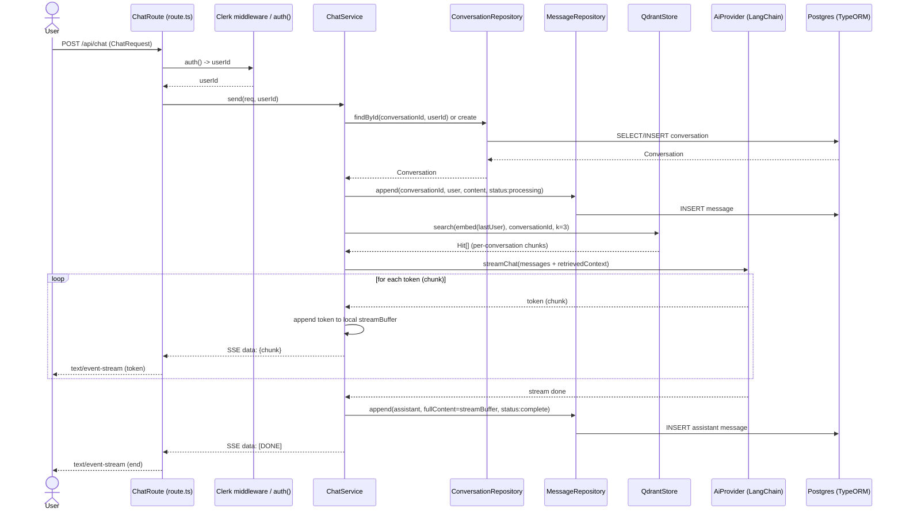
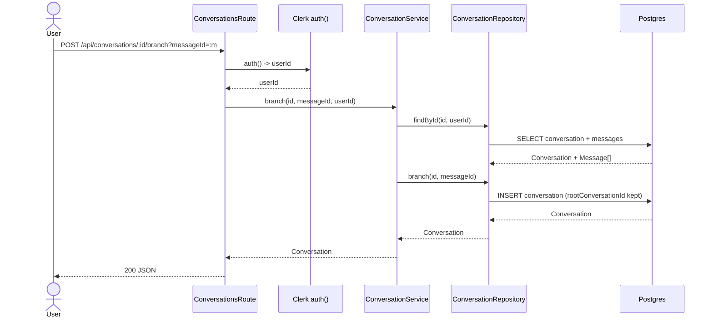
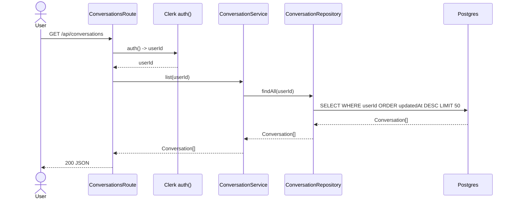
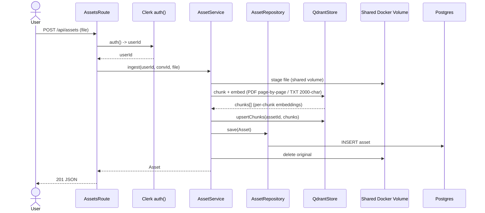
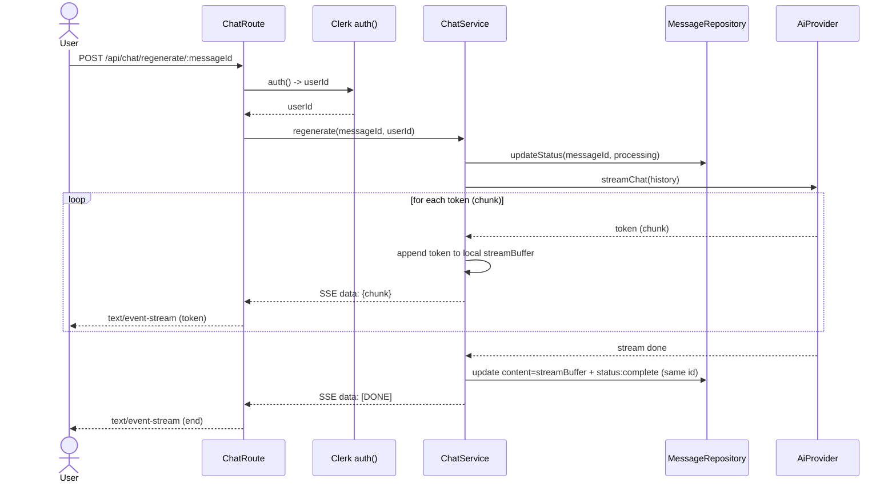
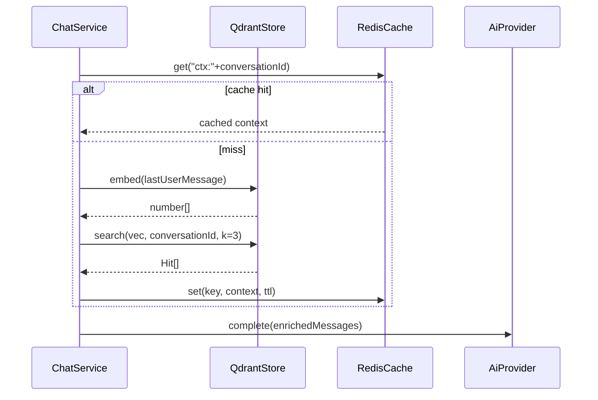
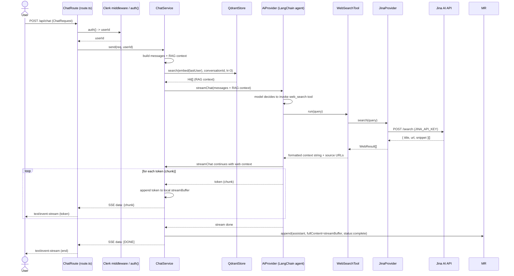
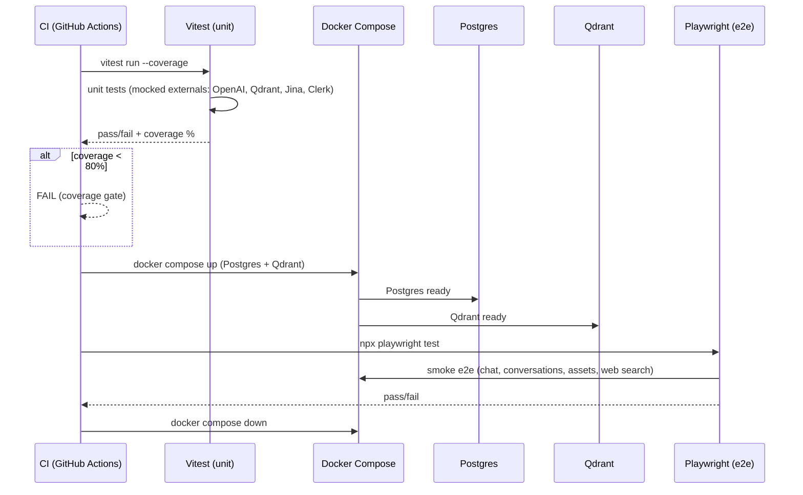

# Sequence Diagrams — chaiGPT (Layered, Next.js + TypeORM, v2)

One diagram per primary flow. Each shows: Next.js route → Clerk auth → service → TypeORM repository / integration (LangChain, Qdrant, Redis). Reflects PRD §9 v2 model.

## 1) Send Chat Message (SSE stream, per-conversation RAG)

Two consumers of the LLM stream: **(a)** each token forwards to the client as SSE live, **(b)** tokens accumulate in a server-side buffer, persisted to Postgres after the stream completes.

> **Stream handling:** `streamBuffer` is an in-memory accumulator in `ChatService`. The client receives tokens progressively; only after the stream closes does the assembled `streamBuffer` get written via `MessageRepository` (`status: complete`). Early termination flushes `status: stopped` with content `"user terminated the response"`.

## 2) Branch from Assistant Message

## 3) List / Get Conversations (user-scoped)

## 4) Asset Upload → Embed (RAG ingest)

## 5) Regenerate a Stopped Message (re-run, same ID)

## 6) Cache + Vector (RAG context reuse)

## 7) Web Search via LangChain Tool (FR-24..FR-28)

The model decides to invoke the web-search tool during completion. `WebSearchTool` calls `JinaProvider.search(query)`, normalizes results as `WebResult[]`, and injects them into the prompt as additional context alongside Qdrant RAG. Source URLs are included for citation.

> **Web search context:** `WebSearchTool` is registered with the LangChain agent (distinct from the RAG retrieval path). Results are ephemeral — only source URLs are cited in the assistant message; no web results are persisted. `JINA_API_KEY` is read from env; missing key fails closed (FR-25).

## 8) CI Test Pipeline (FR-29..FR-34)

