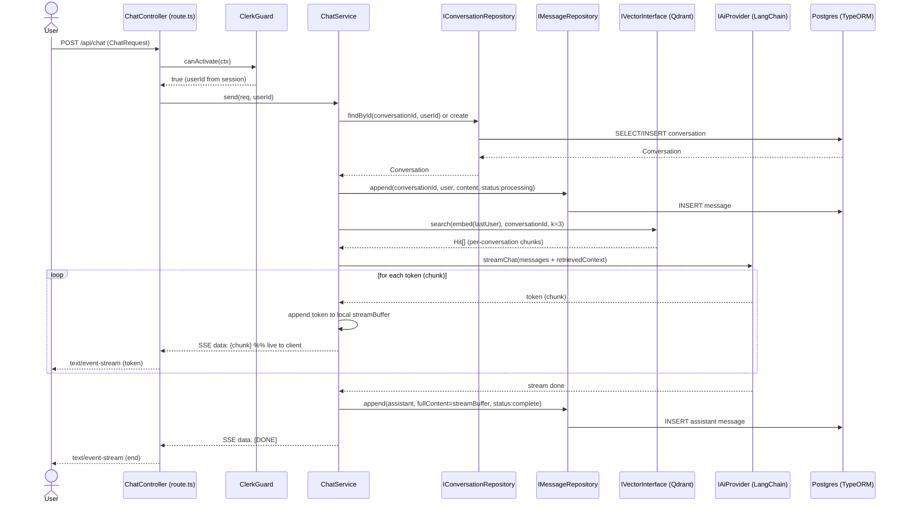
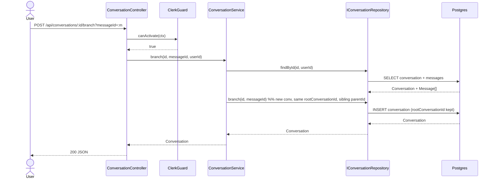
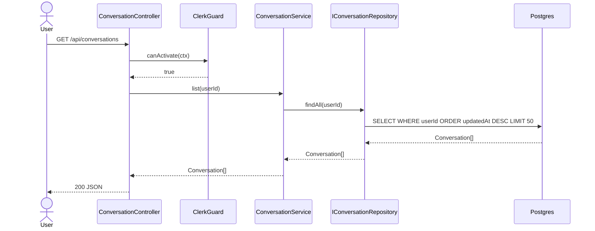
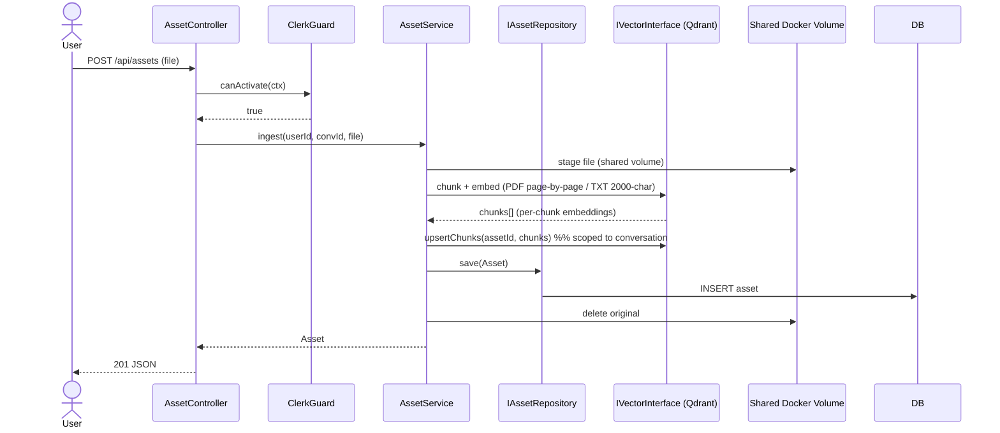
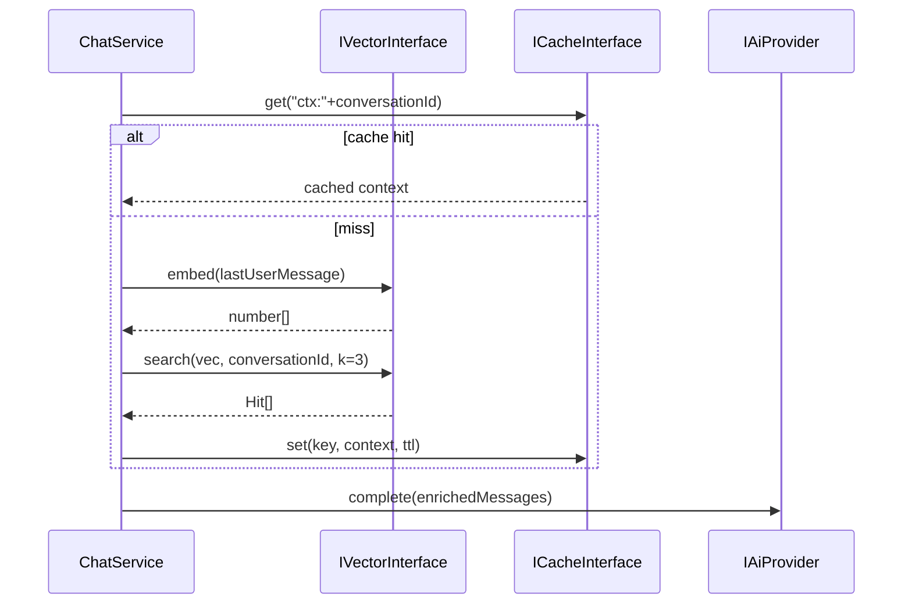

# Sequence Diagrams — chaiGPT (by Separation of Concern, v2)

One diagram per primary flow. Each shows the full hexagonal traversal: inbound controller → Clerk guard → application service → domain interface → adapter → framework. Reflects PRD §9 v2 model.

## 1) Send Chat Message (SSE stream, per-conversation RAG)

Two consumers of the LLM stream: **(a)** each token is forwarded to the client as an SSE chunk immediately, **(b)** tokens are accumulated server-side into a local buffer, then persisted to DB once the stream completes.

> **Stream handling:** `streamBuffer` is an in-memory accumulator in `ChatService` (or the controller) holding the full assistant text. The client receives tokens progressively; only after the stream closes does the assembled `streamBuffer` get written to the `Message` repository (`status: complete`). If the user terminates early, the buffer is flushed with `status: stopped` and content `"user terminated the response"`.

## 2) Branch from Assistant Message

## 3) List / Get Conversations (user-scoped)

## 4) Asset Upload → Embed (RAG ingest)

## 5) Regenerate a Stopped Message (re-run, same ID)

Same streaming behavior as #1: tokens stream live to the client and accumulate in a server-side buffer; the assembled content overwrites the same message ID after the stream ends.

## 6) Cache + Vector (RAG context reuse)

