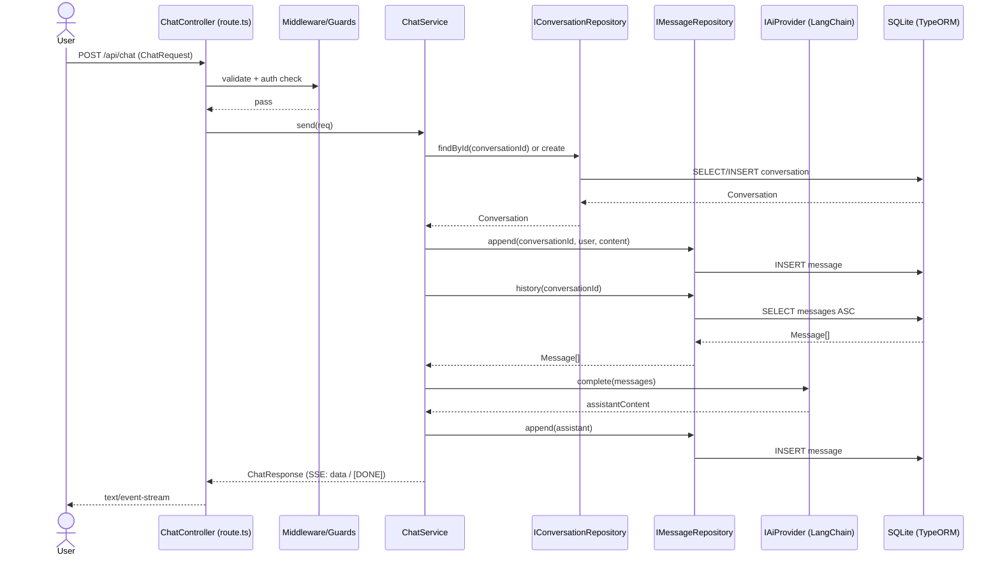
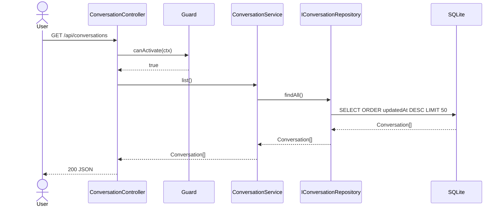
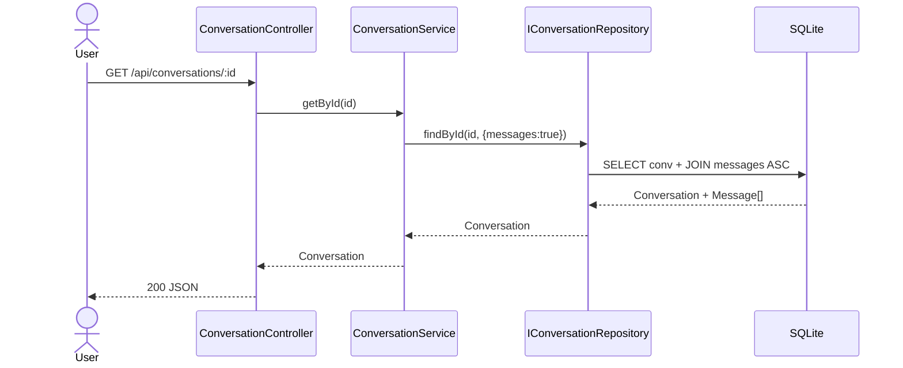
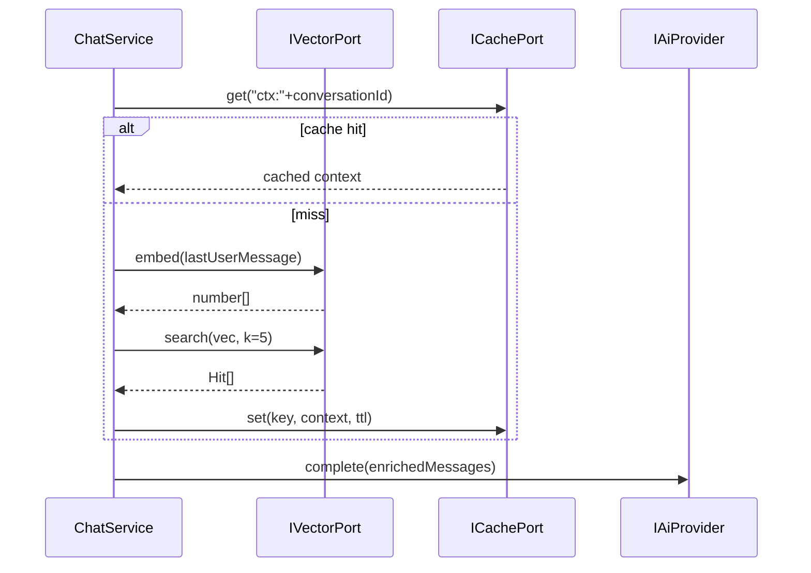

# Sequence Diagrams — chaiGPT (by Separation of Concern)

One diagram per primary flow. Each shows the full hexagonal traversal: inbound controller → cross-cutting → application service → domain port → adapter → framework.

## 1) Send Chat Message (SSE stream)

## 2) List Conversations

## 3) Get Conversation by ID (with messages)

## 4) Cache + Vector cross-cutting (future RAG plugin)

