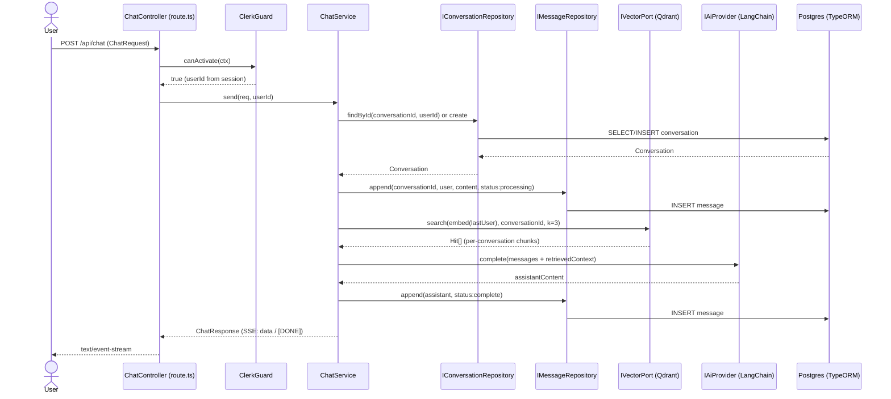
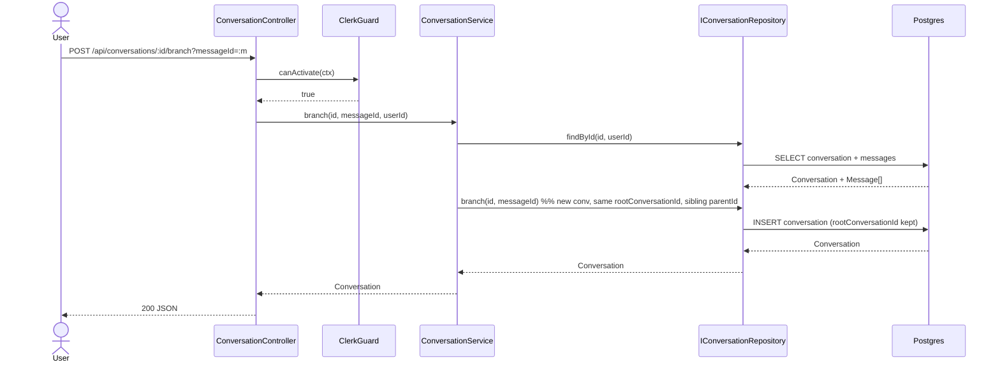
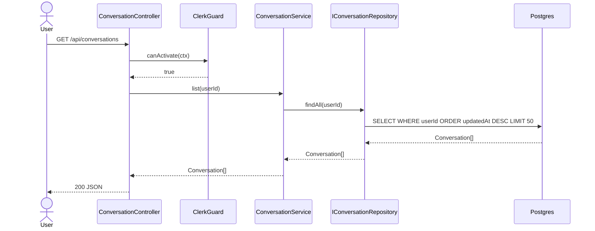
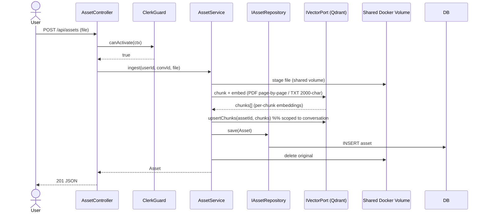
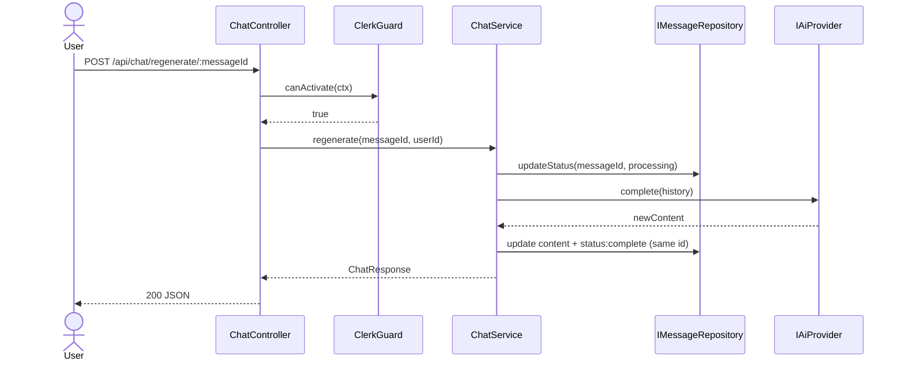

# Sequence Diagrams — chaiGPT (by Separation of Concern, v2)

One diagram per primary flow. Each shows the full hexagonal traversal: inbound controller → Clerk guard → application service → domain port → adapter → framework. Reflects PRD §9 v2 model.

## 1) Send Chat Message (SSE stream, per-conversation RAG)

## 2) Branch from Assistant Message

## 3) List / Get Conversations (user-scoped)

## 4) Asset Upload → Embed (RAG ingest)

## 5) Regenerate a Stopped Message (re-run, same ID)

## 6) Cache + Vector (RAG context reuse)

