# Requirements Diagram — chaiGPT (Integrated Next.js + TypeORM Model)

Captures functional + non-functional requirements and traces them to the planned architecture partitions. Architecture is a layered Next.js + TypeORM structure (tight integration, no port/adapter decoupling). Each requirement maps to a PRD FR/NFR. The AI provider is a LangChain extension over the OpenAI provider (`ChatOpenAI`), kept behind a thin `AiProvider` module (FR-22).

```mermaid
requirementDiagram
    functionalRequirement REQ1 {
        id: 1
        text: Authenticate with Clerk and scope every request to userId
        risk: high
        verifymethod: demonstration
    }
    functionalRequirement REQ2 {
        id: 2
        text: Persist conversations and messages in Postgres via TypeORM
        risk: high
        verifymethod: demonstration
    }
    functionalRequirement REQ3 {
        id: 3
        text: Stream chat completions via LangChain using SSE
        risk: high
        verifymethod: demonstration
    }
    functionalRequirement REQ4 {
        id: 4
        text: Branch conversations via parentId and rootConversationId
        risk: medium
        verifymethod: demonstration
    }
    functionalRequirement REQ5 {
        id: 5
        text: Upload assets to a shared Docker volume embed via LangChain and delete original
        risk: high
        verifymethod: demonstration
    }
    functionalRequirement REQ6 {
        id: 6
        text: Retrieve top 3 per chunk embeddings per conversation from Qdrant
        risk: high
        verifymethod: demonstration
    }
    functionalRequirement REQ7 {
        id: 7
        text: Validate inbound requests with Zod
        risk: low
        verifymethod: test
    }
    functionalRequirement REQ8 {
        id: 8
        text: Layered structure with Next.js routes services and TypeORM repositories
        risk: medium
        verifymethod: inspection
    }
    functionalRequirement REQ9 {
        id: 9
        text: Swap AI model via the LangChain AiProvider module without rewriting services
        risk: low
        verifymethod: test
    }
    functionalRequirement REQ10 {
        id: 10
        text: Cache RAG context in Redis keyed by conversation for reuse
        risk: medium
        verifymethod: demonstration
    }
    performanceRequirement NFR1 {
        id: 11
        text: SOLID compliance with single responsibility per layer
        risk: medium
        verifymethod: inspection
    }
    performanceRequirement NFR2 {
        id: 12
        text: Horizontal scale with stateless route handlers and externalized stores
        risk: high
        verifymethod: analysis
    }

    element Routes {
        type: module
        docRef: "src/app"
    }
    element Services {
        type: module
        docRef: "src/services"
    }
    element Data {
        type: module
        docRef: "src/lib/db"
    }
    element Integrations {
        type: module
        docRef: "src/lib"
    }
    element Schema {
        type: module
        docRef: "schema"
    }

    Routes - satisfies -> REQ1
    Routes - satisfies -> REQ7
    Routes - satisfies -> REQ8
    Routes - satisfies -> NFR2
    Services - satisfies -> REQ2
    Services - satisfies -> REQ3
    Services - satisfies -> REQ4
    Services - satisfies -> REQ6
    Services - satisfies -> REQ9
    Services - satisfies -> NFR1
    Data - satisfies -> REQ2
    Data - satisfies -> REQ4
    Integrations - satisfies -> REQ3
    Integrations - satisfies -> REQ5
    Integrations - satisfies -> REQ6
    Integrations - satisfies -> REQ9
    Integrations - satisfies -> REQ10
    Schema - satisfies -> REQ2
    Schema - satisfies -> REQ5
    Schema - satisfies -> REQ6
    Schema - satisfies -> REQ10

    REQ8 - verifies -> REQ2
    REQ9 - verifies -> REQ3
    NFR1 - satisfies -> REQ8
```

## Requirement → PRD Mapping

| Diagram REQ | PRD FR/NFR | Description |
|-------------|------------|-------------|
| REQ1 | FR-1, FR-2, FR-3, FR-23 | Clerk auth, userId scoping, 401/redirect, middleware |
| REQ2 | FR-4, FR-5, FR-21 | Postgres/TypeORM persistence, v2 entity fields |
| REQ3 | FR-6, FR-19 | SSE streaming, status lifecycle |
| REQ4 | FR-8, FR-9, FR-10, FR-11 | Branching via parentId/rootConversationId |
| REQ5 | FR-12, FR-13, FR-16, FR-17 | Asset lifecycle, chunking, preserve/delete |
| REQ6 | FR-14, FR-15 | Qdrant per-chunk embed, top-3 per conversation, prompt injection |
| REQ7 | FR-20 | Zod validation |
| REQ8 | FR-21, NFR-1 | Layered integrated architecture |
| REQ9 | FR-22 | AiProvider (LangChain OpenAI) swap without rewriting services |
| REQ10 | NFR-2 | Redis KV cache for RAG context reuse |
| NFR1 | NFR-1 | SOLID per layer |
| NFR2 | NFR-2 | Horizontal scale, externalized stores |

Covered PRD FRs: FR-1..FR-23 (FR-7, FR-18 also traced via Services/Routes at implementation). NFRs: NFR-1, NFR-2 (latency/coverage NFRs NFR-3..NFR-7 are verified at runtime/CI, not diagram partitions).
