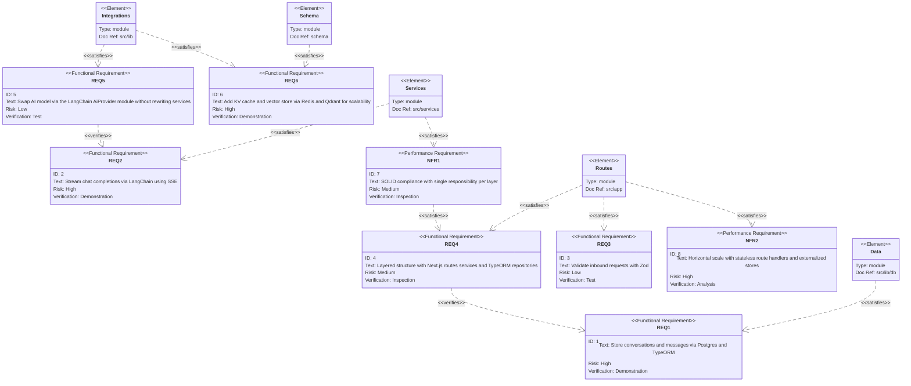

# Requirements Diagram — chaiGPT Re-architecture

Captures functional + non-functional requirements and traces them to the planned architecture partitions. Architecture is a layered Next.js + TypeORM structure (tight integration, no port/adapter decoupling).

