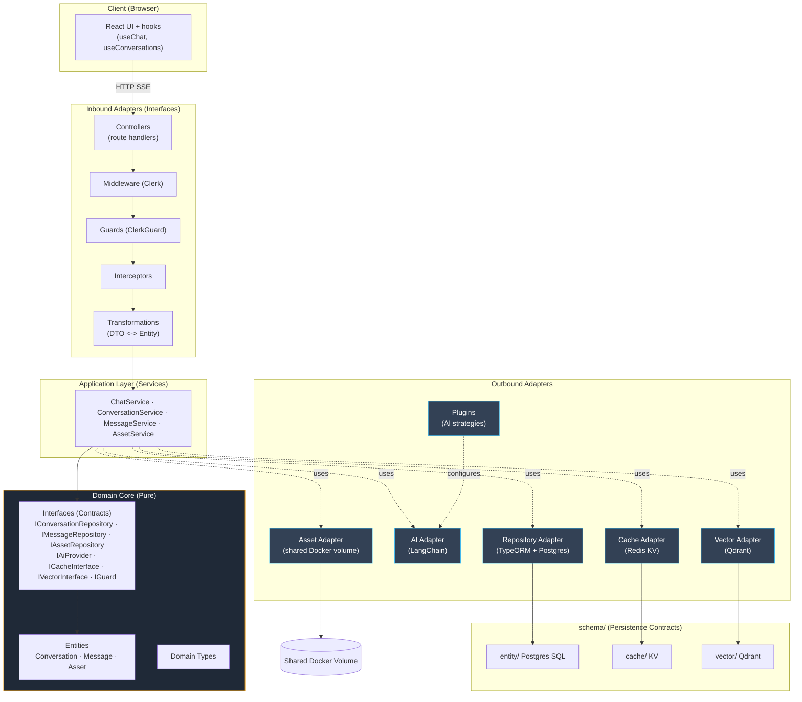

# Architecture Diagram — chaiGPT (Hexagonal / Interfaces & Adapters, v2)

The domain core is the hub. Inbound adapters (Next controllers, Clerk middleware/guard, interceptors, transformations) drive application services. Outbound adapters (Postgres repository, LangChain AI, Redis cache, Qdrant vector, asset filesystem) implement domain interfaces. `schema/` is the persistence contract layer (entity/cache/vector). Reflects PRD §9 v2 model.

