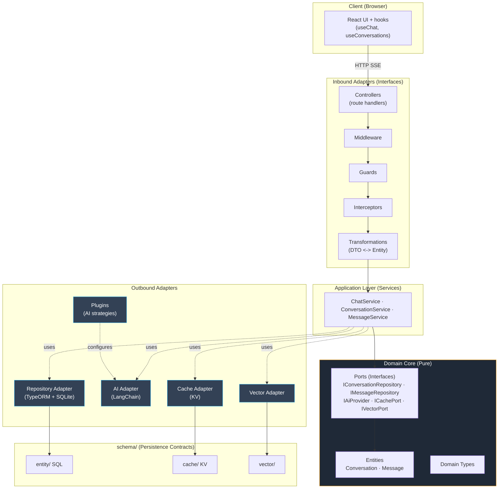

# Architecture Diagram — chaiGPT (Hexagonal / Ports & Adapters)

The domain core is the hub. Inbound adapters (Next controllers, middleware, guards, interceptors) drive application services. Outbound adapters (repository, AI, cache, vector) implement domain ports. `schema/` is the persistence contract layer.

