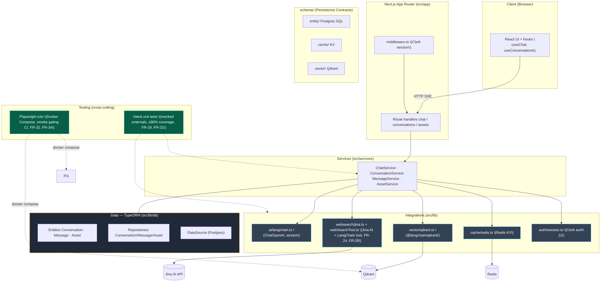

# Architecture Diagram — chaiGPT (Layered, Next.js + TypeORM, v2)

Tightly integrated with Next.js (App Router, route handlers, middleware) and TypeORM (entities, repositories, migrations). Separation is by concern — routes → services → data/integrations — with **no port/adapter abstraction** to decouple frameworks. Reflects PRD §9 v2 model.

