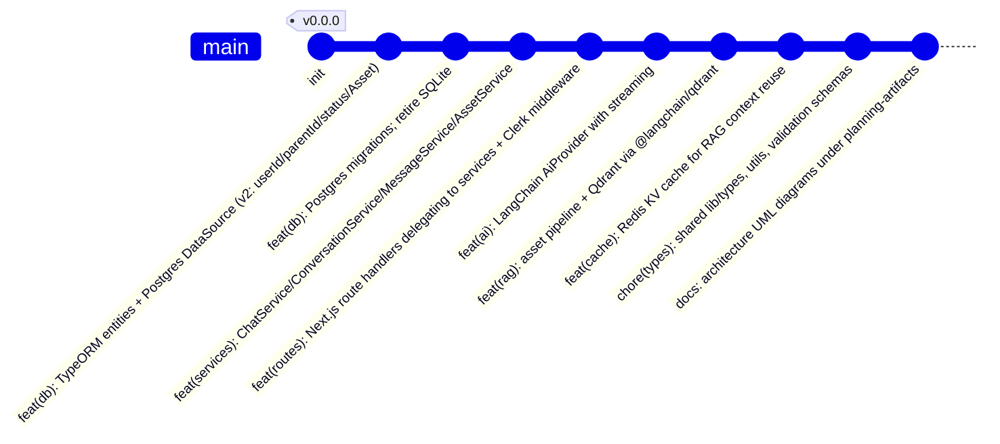

# Git Commit Plan — chaiGPT (main branch only)

Conventional-commit messages for landing the re-architecture on `main`, ordered so each step is independently reviewable and the build stays green.

## Commit message table

| # | Scope | Type | Message |
|---|-------|------|---------|
| 1 | db | feat | TypeORM entities + Postgres DataSource (v2) |
| 2 | db | feat | Postgres migrations; retire SQLite |
| 3 | services | feat | Chat/Conversation/Message/Asset services |
| 4 | routes | feat | Next.js route handlers + Clerk middleware |
| 5 | ai | feat | LangChain AiProvider with streaming |
| 6 | rag | feat | asset pipeline + Qdrant via @langchain/qdrant |
| 7 | cache | feat | Redis KV cache for RAG context reuse |
| 8 | types | chore | shared lib/types, utils, validation schemas |
| 9 | docs | docs | architecture UML diagrams |
