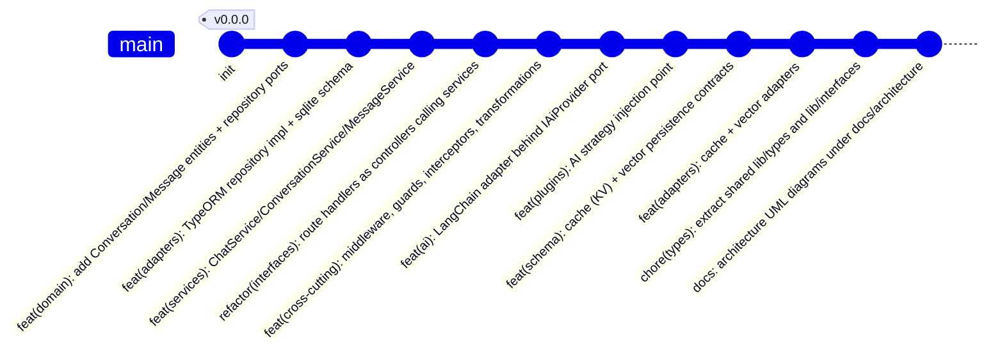

# Git Commit Plan — chaiGPT (main branch only)

Conventional-commit messages for landing the hexagonal re-architecture on `main`, ordered so each step is independently reviewable and the build stays green.

## Commit message table

| # | Scope | Type | Message |
|---|-------|------|---------|
| 1 | domain | feat | add Conversation/Message entities and repository ports |
| 2 | adapters | feat | implement TypeORM repository adapter + SQLite schema |
| 3 | services | feat | add Chat/Conversation/Message application services |
| 4 | interfaces | refactor | route handlers as controllers delegating to services |
| 5 | cross-cutting | feat | add middleware, guards, interceptors, transformations |
| 6 | ai | feat | LangChain adapter behind IAiProvider port |
| 7 | plugins | feat | AI strategy injection point |
| 8 | schema | feat | add cache (KV) and vector persistence contracts |
| 9 | adapters | feat | implement cache and vector adapters |
| 10 | types | chore | extract shared lib/types and lib/interfaces |
| 11 | docs | docs | add architecture UML diagrams to docs/architecture |
