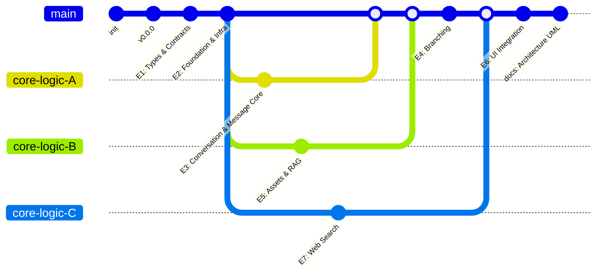

# Git Commit Plan — chaiGPT (main branch only)

Conventional commit messages for landing the re-architecture on `main`, aligned with parallel epics execution from `parallel-epics-plan.md`.

---

## Mermaid Diagram — Parallel Commit Flow

---

## Pipeline-based Commit Map

### Pipeline 1 — Foundation Setup (Sequential)

1. `chore: E1 Types & Contracts - shared lib/types, utils, validation schemas`
2. `feat: E2 Foundation & Infra - Postgres DataSource, migrations, Redis cache`

---

### Pipeline 2 — Core Logic Development (Parallel Execution)

3. `feat: E3 Conversation & Message Core - Chat/Conversation/Message/Asset services`
4. `feat: E5 Assets & RAG - asset pipeline + Qdrant via @langchain/qdrant`
5. `feat: E7 Web Search - LangChain AiProvider + Jina integration`

---

### Pipeline 3 — Integration Features

6. `feat: E4 Branching - Branching logic in ConversationService`
7. `feat: E6 UI Integration - Next.js route handlers + Clerk middleware`
8. `docs: Architecture UML diagrams under planning-artifacts`

---

## Execution Order Constraints

- Pipeline 1 **must complete** before Pipeline 2 starts.
- Pipeline 2 executes **in parallel**:
  - E3 — Conversation & Message Core
  - E5 — Assets & RAG
  - E7 — Web Search
- E4 (Branching) depends on E3 being completed.
- E6 (UI Integration) should be implemented after E4 has been merged.
- Documentation is committed after all implementation work is complete.