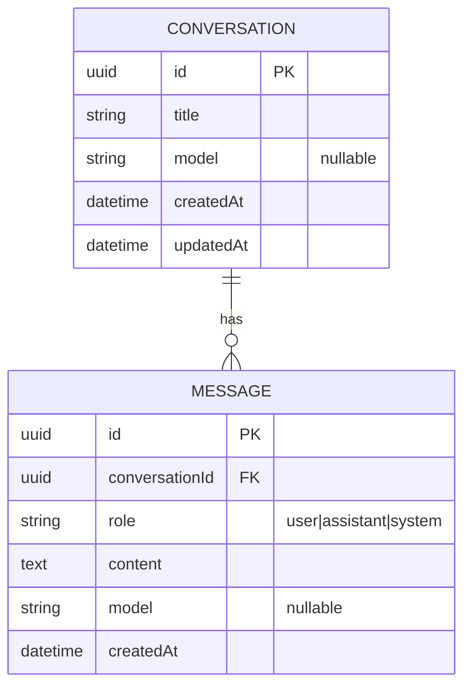
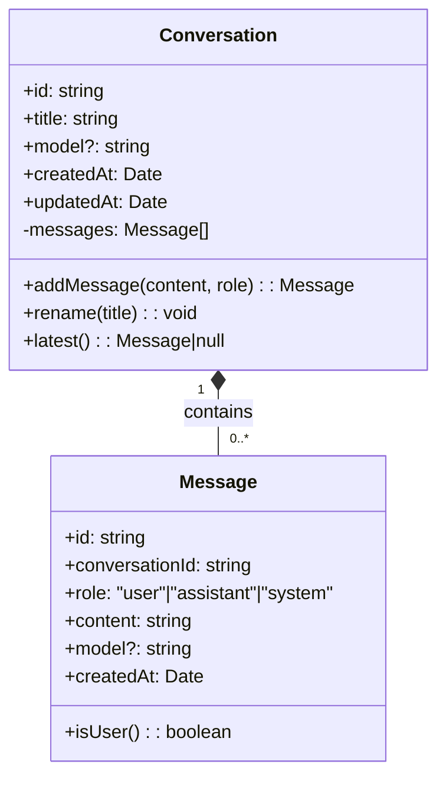
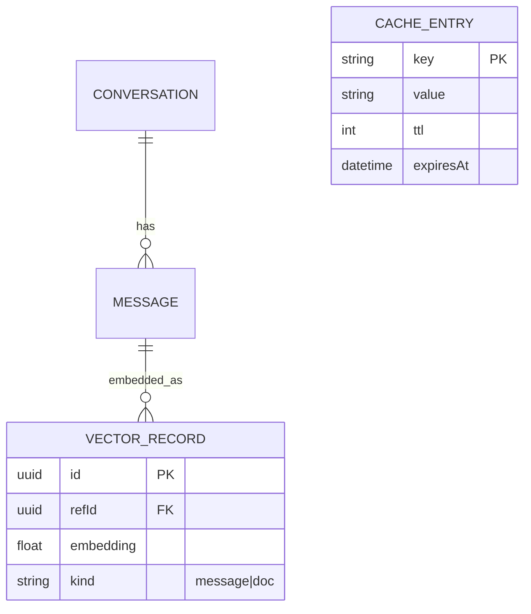

# Entity Diagram — chaiGPT Persistence Model

Mirrors `schema/entity/` (SQL) and the TypeORM entities today: `Conversation` 1—* `Message`.

## Entity as Class (for domain modeling)

## schema/ partition (entity / cache / vector)

