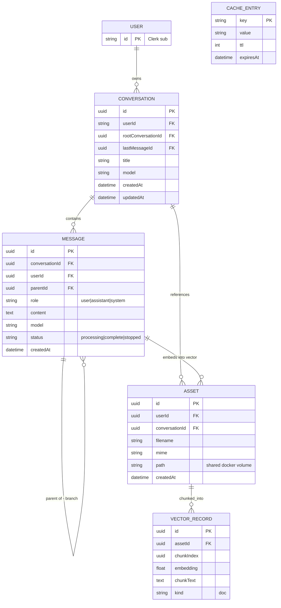
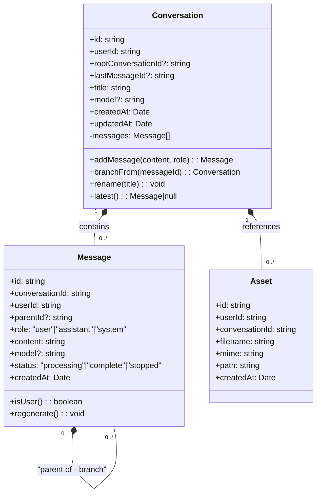
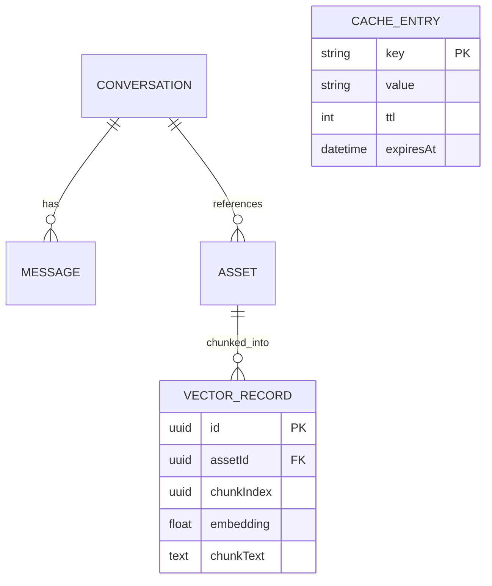

# Entity Diagram — chaiGPT Persistence Model (v2)

Mirrors the PRD §9 v2 data model and `schema/`: `entity/` (Postgres SQL via TypeORM), `cache/` (KV), `vector/` (Qdrant). Entities are defined with TypeORM decorators and persisted to Postgres.

> **Note — no entity change for web search (FR-24..FR-28):** Web search results from Jina AI are ephemeral runtime objects (`WebResult`). They are injected into the prompt as additional context alongside Qdrant RAG and cited via source URLs in the assistant message. No new table or entity is added; only `JINA_API_KEY` is required as an environment variable (FR-25).

## Entity as Class (domain model)

## schema/ partition (entity / cache / vector)

