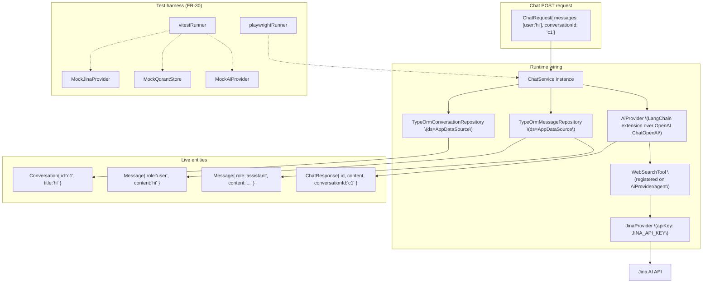

# Object Diagram — chaiGPT Runtime Instances

Snapshots of live objects during a chat request, showing concrete instances wired to services (dependency injection at runtime). The `AiProvider` is a LangChain extension wrapping the OpenAI provider (`ChatOpenAI`); there is no separate strategy/port layer.

