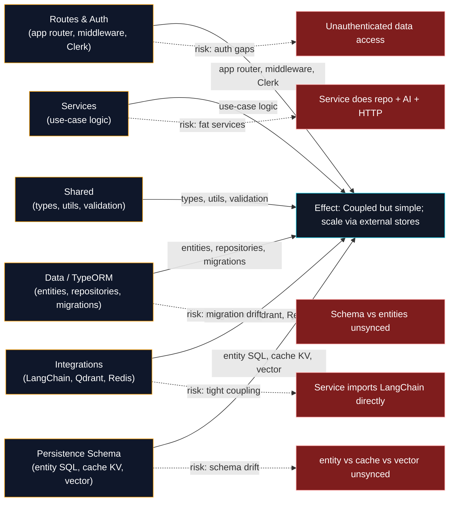

# Component Architecture — Ishikawa (Fishbone) by Concern & Type

Root-cause / concern analysis grouped by category. Each bone is a partition; effects are the risks the architecture must resolve or the value it delivers.

## Component grouping (concern × type)

| Concern | Class | Integration | Schema |
|---------|-------|-------------|--------|
| Routes & Auth | ChatRoute, ConversationsRoute, AssetsRoute | Clerk (`auth()`) | — |
| Services | ChatService, ConversationService, MessageService, AssetService | — | — |
| Data | ConversationRepository, MessageRepository, AssetRepository | TypeORM → Postgres | entity/ (SQL) |
| AI | AiProvider | LangChain `ChatOpenAI` | — |
| Retrieval | QdrantStore | `@langchain/qdrant` | vector/ |
| Cache | RedisCache | Redis | cache/ (KV) |
| Shared | utils, validation schemas | — | — |
