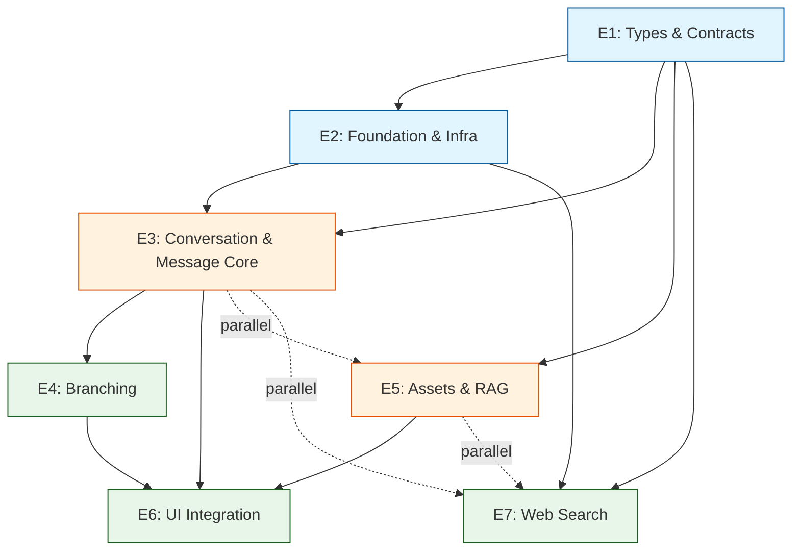

# Parallel Epics Plan

## Pipeline Dependencies

## Pipeline Groups

| Pipeline | Epics | Dependencies | Color |
|----------|-------|-------------|-------|
| **1: Foundation Setup** | E1, E2 | E1→E2 | 🔵 Blue |
| **2: Core Logic** | E3, E5 | E1→E3, E1→E5 (E3/E5 parallel) | 🟠 Orange |
| **3: Integration** | E4, E6, E7 | E3→E4, E3/E4/E5→E6, E1/E2→E7 | 🟢 Green |

## Parallel Execution Plan

1. **Pipeline 1** completes first (E1 → E2 sequentially)
2. **Pipeline 2** runs in parallel after E1 (E3 and E5 simultaneously)
3. **Pipeline 3** starts after Pipeline 2 dependencies met

## Dependency Summary

- **E1**: No dependencies
- **E2**: Depends on E1
- **E3**: Depends on E1, E2
- **E4**: Depends on E3
- **E5**: Depends on E1
- **E6**: Depends on E3, E4, E5
- **E7**: Depends on E1, E2

## Execution Order

1. Complete E1 (Types & Contracts)
2. Execute E2 (Foundation & Infra) 
3. Run E3 and E5 in parallel (Conversation Core and Assets & RAG)
4. Execute E4 (Branching) after E3 completes
5. Complete E6 (UI Integration) after E3, E4, E5 complete
6. Execute E7 (Web Search) independently after E1/E2 complete

This plan enables parallel execution of E3 and E5 while respecting all dependency constraints. E7 can run concurrently with E2 completion since it only depends on E1/E2.