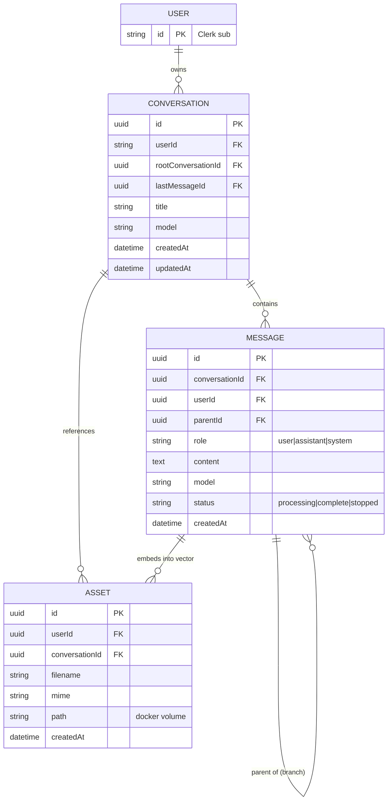

# chaiGPT — Product Requirements Document

## 1. Purpose & Background

chaiGPT is a context-aware conversational AI platform. Today it is a flat Next.js 16 chat app: a sidebar conversation list, SQLite persistence via TypeORM (`Conversation`, `Message`), and streaming LLM responses via LangChain. There is no auth, no branching, no document retrieval, and no asset handling.

The brief defines a target where **authenticated users** hold branching conversations, upload documents for retrieval-augmented generation (RAG), and keep persistent, account-scoped history. The architecture is a **layered structure tightly integrated with Next.js (App Router, route handlers, middleware) and TypeORM (entities, migrations, repositories)** — separation by concern, not framework isolation. Coupling to Next.js and TypeORM is approved and intentional.

This PRD reconciles the brief's target state with the planned architecture. Where the brief implies new entities/flows not yet in the UML, they are captured here as new requirements and flagged for a follow-up architecture update.

## 2. Goals

- **G1** — Authenticated, account-scoped chat (Clerk).
- **G2** — Branching conversations with sibling-thread sidebar behavior.
- **G3** — Document upload → embed → retrieve (RAG) via Qdrant.
- **G4** — Asset lifecycle (upload, embed, reference, explicit delete) on a named Docker volume.
- **G5** — Layered architecture tightly integrated with Next.js + TypeORM: clean separation by concern (routes, services, entities, repositories), no artificial framework-decoupling layer.
- **G6** — Production-grade infra (Postgres + Qdrant via Docker Compose, dev/prod scripts).
- **G7** — Live web search capability: the assistant can fetch current, web-sourced answers via Jina AI, complementing RAG over uploaded docs.
- **G8** — Testing & quality: unit tests (Vitest) with mocked externals plus end-to-end tests (Playwright), gated in CI.

## 3. Non-Goals (Out of Scope, v1)

- Custom design system work.
- Full branch-tree visualization.
- Organizations / multi-tenancy beyond Clerk user scoping.
- External object storage (local filesystem staging only in v1).

## 4. Stakeholders & Personas

- **End User** — wants private, branching, document-aware chats.
- **Platform Engineer** — owns Docker/infra, DB migrations, scaling.
- **Maintainer** — owns the Next.js + TypeORM codebase, services, and tests.

## 5. User Stories

| ID | As a… | I want… | So that… |
|----|-------|---------|----------|
| US-1 | user | sign in with Clerk | my conversations are private to me |
| US-2 | user | start a new conversation | I can begin a fresh chat |
| US-3 | user | send a message and stream the reply | I get fast feedback |
| US-4 | user | branch from any assistant message | I can explore alternatives |
| US-5 | user | see only sibling branches in the sidebar | I'm not lost in the tree |
| US-6 | user | upload PDF/TXT/MD | the model answers using my docs |
| US-7 | user | edit my latest user message | I can correct a typo without a new branch |
| US-8 | user | see pasted/long content become a `.txt` asset | I stay within the 500-char limit |
| US-9 | user | have assets preserved in deleted replies | history stays coherent |
| US-10 | maintainer | swap AI model/provider via the AiProvider module | I keep services unchanged |
| US-11 | maintainer | run dev/prod stacks via npm scripts | I reproduce envs consistently |
| US-12 | user | get web-sourced answers for live-data questions | I get current information beyond the model's training cutoff and my uploaded docs |
| US-13 | maintainer | run unit + e2e tests | I can trust that changes don't break auth, branching, RAG, or web search |

## 6. Functional Requirements

### 6.1 Authentication & Scoping
- **FR-1 [Must]** Integrate Clerk (`@clerk/nextjs`); Next.js middleware protects routes and route handlers read the session via `auth()` from `@clerk/nextjs/server`.
- **FR-2 [Must]** All conversations and messages are scoped to `userId` (Clerk `sub`).
- **FR-3 [Must]** Unauthenticated requests to protected routes return 401 / redirect.

### 6.2 Conversation & Message Model (v2)
- **FR-4 [Must]** `Conversation` gains: `userId`, `rootConversationId`, `lastMessageId`, `model`.
- **FR-5 [Must]** `Message` gains: `userId`, `parentId`, `status` enum (`processing` | `complete` | `stopped`), retains `role`/`content`/`model`.
- **FR-6 [Must]** On send: user message saved, trailing assistant message created with `status: processing`; on stream completion → `complete`; on explicit termination → content `"user terminated the response"`, `status: stopped`.
- **FR-7 [Must]** Max 500 characters per message; paste > 200 chars → converted to `.txt` asset and uploaded.

### 6.3 Branching
- **FR-8 [Must]** Sibling messages share `parentId`; branched conversations share `rootConversationId`.
- **FR-9 [Must]** Branching from an assistant message creates a sibling under the same parent; sidebar shows only siblings of the active branch.
- **FR-10 [Must]** Editing updates only the most recently created sibling; branching continues from that message.
- **FR-11 [Must]** Editing is content-only, in place (same IDs); does not affect branching; `lastMessageId` unchanged.

### 6.4 Retrieval-Augmented Generation
- **FR-12 [Must]** Asset upload stages to a **shared named Docker volume**, embeds via LangChain, deletes original; no external object store in v1. Logical user isolation is enforced at the DB layer (`Asset.userId`), not at the volume level.
- **FR-13 [Must]** PDFs chunked page-by-page; TXT/MD chunked at 2000 characters (LangChain splitters).
- **FR-14 [Must]** Qdrant stores **one embedding per chunk**; top-3 segments retrieved per query, scoped to the **current conversation's** linked assets via `@langchain/qdrant`. Each vector record references its parent chunk + asset for citation.
- **FR-15 [Must]** Retrieved context is injected into the prompt before completion.

### 6.5 Asset Lifecycle
- **FR-16 [Should]** Assets referenced in deleted assistant replies are preserved and shown; user may explicitly delete.
- **FR-17 [Should]** In edit mode, trailing assistant asset references remain visible with an option to remove per user action.

### 6.6 Streaming & Validation
- **FR-18 [Should]** A `status: stopped` assistant message is **re-runnable**: the user can regenerate a new completion that overwrites the same message ID (`status` → `processing` → `complete`). This does not create a branch.
- **FR-19 [Must]** Chat completions stream via SSE (existing behavior, preserved).
- **FR-20 [Must]** Inbound requests validated with Zod (`ChatRequestSchema`, `ConversationSchema`, etc.).

### 6.7 Architecture & Extensibility
- **FR-21 [Must]** Tightly integrated layered architecture: Next.js App Router route handlers are the entry point; services hold use-case logic; TypeORM entities + repositories own persistence (Postgres). No framework-decoupling abstraction layer is required — coupling to Next.js and TypeORM is approved.
- **FR-22 [Should]** AI provider kept behind a thin `AiProvider` module (LangChain) so the model can be swapped without rewriting services; not a hard port boundary.
- **FR-23 [Should]** Cross-cutting concerns (Clerk auth, logging) handled by Next.js middleware / route-handler helpers rather than a separate interceptor framework.

### 6.8 Web Search (Jina AI)
- **FR-24 [Should]** Integrate a **Jina web-search client** (Jina AI Search / Reader API) as a thin module (`JinaProvider`/`WebSearchProvider`) that issues live web queries and normalizes results (title, URL, snippet/content) for downstream consumption.
- **FR-25 [Must]** Jina API access is configured via environment variable (`JINA_API_KEY`) surfaced in `.env.example`; the key is never hard-coded and requests fail closed with a clear error when the key is missing.
- **FR-26 [Should]** Jina web results are available as an **additional context source in retrieval**, alongside Qdrant RAG. Web-sourced context is injected into the prompt before completion (consistent with FR-15) and each web result carries its source URL for citation. Web context supplements, and does not replace, per-conversation RAG (FR-14).

### 6.9 Web Search Tool (LangChain)
- **FR-27 [Must]** Expose web search as a **LangChain tool** the LLM can invoke, so the model itself decides *when* a live web lookup is warranted. This tool is **distinct from RAG over uploaded docs**: RAG retrieves from the current conversation's embedded assets (FR-14), while the web-search tool calls Jina (FR-24) for live external information.
- **FR-28 [Should]** Define the tool with a typed schema (name, description, input args validated via Zod) and register it with the `AiProvider`/agent so tool-calls are routed to the Jina client (FR-24). Tool invocations, results, and any source URLs are captured in the completion path for citation and observability.

### 6.10 Unit Testing
- **FR-29 [Must]** Unit tests use **Vitest**, colocated with the code under test (services and repositories), e.g. `*.test.ts` next to each service/repository.
- **FR-30 [Must]** External dependencies are **mocked** in unit tests — OpenAI/LangChain, Qdrant, Jina, and Clerk — so unit tests run offline and deterministically with no network access.
- **FR-31 [Must]** A coverage gate enforces **≥ 80% coverage of services + repositories** (ties to NFR-7); the suite fails below threshold and is enforced in CI.

### 6.11 End-to-End Testing
- **FR-32 [Must]** End-to-end tests use **Playwright** (selected as best fit for Next.js 16 App Router — first-class Clerk-authenticated flows and reliable handling of the streaming SSE chat UI).
- **FR-33 [Must]** E2E scope covers the critical user journeys: **auth-gated flows** (sign-in / protected redirects), **branching**, **asset upload**, **RAG answers**, and **web search**.
- **FR-34 [Should]** E2E tests run against a **Docker Compose stack (Postgres + Qdrant)** to exercise real persistence and vector retrieval; a smoke subset (auth, branch, asset, RAG, search) gates CI.

> v1 scope uses Must/Should only; Could-priority items are deferred to v2.

### 6.12 Additional Requirements
- npm lifecycle scripts (start:dev, start:dev:infra, stop:dev:infra, start:prod, stop:prod) reproduce the full stack (Postgres + Qdrant + app) — fulfills US-11 and brief Infra.

## 7. Non-Functional Requirements

| ID | Requirement | Target |
|----|-------------|--------|
| NFR-1 | SOLID / single-responsibility per layer | No business logic in route handlers; I/O delegated to services (inspection) |
| NFR-2 | Horizontal scale — stateless route handlers, externalized stores (Postgres/Qdrant/Redis) | Route handlers stateless; all state externalized to Postgres/Qdrant/Redis (analysis) |
| NFR-3 | Auth latency overhead | < 50 ms per request (p95) |
| NFR-4 | RAG retrieval latency | < 300 ms (p95) for top-3 |
| NFR-5 | Streaming time-to-first-token | < 1 s |
| NFR-6 | DB migrations are reversible (TypeORM) | Required for prod |
| NFR-7 | Test coverage of services + repositories | ≥ 80% |
| NFR-8 | Unit tests deterministic & offline (externals mocked: OpenAI, Qdrant, Jina, Clerk) via Vitest | Required for CI |
| NFR-9 | E2E smoke suite (Playwright) green against Docker Compose (Postgres + Qdrant) | Required gate in CI |
| NFR-10 | Web search latency overhead (Jina query round-trip) | < 1.5 s (p95) |
| NFR-11 | RAG retrieval relevance (top-3) on designated eval set | ≥ 90% |

## 8. Architecture Alignment (from UML artifacts)

The layered plan (`05-architecture.md`) maps directly to requirements:
- **Routes (Next.js App Router)** — route handlers, Clerk middleware. → FR-1, FR-20.
- **Services** — `ChatService`, `ConversationService`, `MessageService`, `AssetService` (use-case logic). → FR-6, FR-8.
- **Entities + Repositories (TypeORM)** — `Conversation`, `Message`, `Asset` entities; TypeORM repositories for Postgres. → FR-21.
- **Integrations** — LangChain AI, Qdrant vector store, KV cache, asset filesystem, **Jina web-search client + web-search LangChain tool**. → FR-14, FR-22, FR-24, FR-27.
- **schema/** — `entity/` (SQL migrations), `cache/` (KV), `vector/` (Qdrant). → FR-21.
- **Testing** — Vitest unit tests colocated with services/repositories (externals mocked); Playwright e2e against Docker Compose. → FR-29..FR-34, NFR-7..NFR-9.

### 8.1 Gaps between Brief and current UML (action required)
The UML still carries the old hexagonal port/adapter wording and must be simplified to the tightly-integrated Next.js + TypeORM model:
1. `User` linkage / `userId` scoping on entities (FR-2).
2. `parentId`, `rootConversationId`, `lastMessageId`, `status` on `Message`/`Conversation` (FR-4, FR-5).
3. `Asset` entity and its lifecycle (FR-12, FR-16).
4. Qdrant used directly via `@langchain/qdrant` (no generic adapter indirection).
5. Postgres via TypeORM migrations from SQLite (brief decision #1).
6. Clerk auth via Next.js middleware + `auth()` in route handlers (no separate `IGuard` port).

> **Resolved:** UML artifacts (01/02/03/05/07/08/09) updated to the tightly-integrated Next.js + TypeORM model; ports/adapters/plugins dropped. See prd-validation-report.md (B1 resolved).

## 9. Data Model (v2 — supersedes current entities)

## 10. Success Metrics

- Auth-gated app with 0 unauthenticated data leaks (FR-3).
- Branching behaves per FR-8..FR-11 in manual + automated tests.
- RAG answers cite uploaded docs in eval set (≥ 90% top-3 relevance).
- Web-search answers cite live source URLs when the web-search tool is invoked (FR-26, FR-28).
- Green CI test suite: unit coverage ≥ 80% (services + repositories) plus an e2e smoke pass of auth, branching, asset upload, RAG, and web search.
- `npm run start:dev` brings up Postgres + Qdrant + app with named volume.

## 11. Dependencies & Assumptions

- Clerk project + keys available (`.env.example`).
- Docker + Docker Compose installed in dev/prod.
- OpenAI-compatible key for LangChain (`gpt-4o-mini` default).
- Jina AI API key for web search (`JINA_API_KEY` in `.env.example`).
- Playwright browser binaries installed for e2e (`npx playwright install`).
- Fresh Postgres start; existing SQLite data cleared (brief decision #4).

## 12. Migration / Build Sequence (from `06-git.md`)

1. TypeORM entities (v2 with userId/parentId/status/Asset) + Postgres DataSource.
2. TypeORM migrations; retire SQLite.
3. Services (chat/conversation/message/asset) with branching + status.
4. Next.js route handlers delegating to services; Clerk middleware.
5. LangChain `AiProvider` module.
6. Asset pipeline + Qdrant via `@langchain/qdrant`.
7. KV cache module.
8. Jina web-search client (`JINA_API_KEY`) as an additional context source.
9. Web-search LangChain tool (tool definition + invocation path via `AiProvider`).
10. Test harness: Vitest unit tests (mocked externals, ≥80% service/repo coverage) + Playwright e2e (auth/branch/asset/RAG/search against Docker Compose).
11. Shared `lib/types`, `lib/utils`.
12. Update UML artifacts to the integrated model, then docs.

## 13. Resolved Decisions (formerly Open Questions)

- **Q1 (volume):** Shared named Docker volume for all users; logical isolation via `Asset.userId` at DB layer. → FR-12.
- **Q2 (RAG scope):** Per-conversation — retrieve top-3 only from the current conversation's linked assets. → FR-14.
- **Q3 (stopped re-run):** Re-runnable — regenerate overwrites same message ID, no branch created. → FR-18.
- **Q4 (embed granularity):** Per chunk — one embedding per LangChain chunk (page / 2000-char); each vector record references parent chunk + asset for citation. → FR-14.
- **Q5 (web context source):** Jina AI is the live web context source, exposed both as an additional retrieval source and as an LLM-invoked LangChain tool distinct from RAG. → FR-24, FR-26, FR-27.
- **Q6 (e2e tooling):** End-to-end testing uses **Playwright** — best fit for Next.js 16 App Router, Clerk-authenticated flows, and streaming SSE UI. → FR-32.
- **Q7 (unit tooling):** Unit tests use **Vitest** with all externals mocked (OpenAI, Qdrant, Jina, Clerk), colocated with services/repositories, ≥80% coverage gate. → FR-29..FR-31.

## 14. Known Issues / Accepted Bugs

- **KI-1** After a branch is started from a message, subsequent retries on that branch are ignored (no new sibling created). Approved as accepted behavior per brief; not a requirement. Branching continues from the most recently updated sibling (FR-10).
- **KI-2** `conversations.last_message_id` is not updated by message editing (FR-11) — by design, to keep branch pointers stable.
