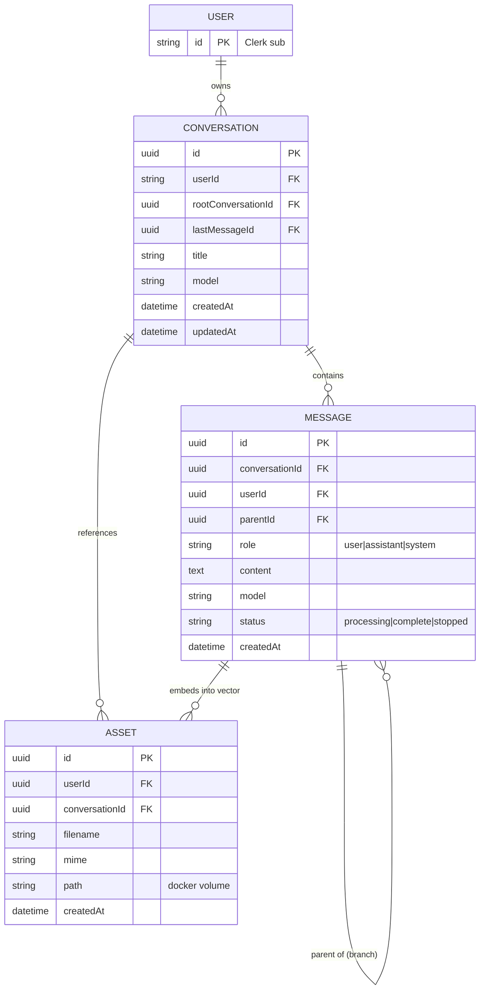

# chaiGPT — Product Requirements Document

## 1. Purpose & Background

chaiGPT is a context-aware conversational AI platform. Today it is a flat Next.js 16 chat app: a sidebar conversation list, SQLite persistence via TypeORM (`Conversation`, `Message`), and streaming LLM responses via LangChain. There is no auth, no branching, no document retrieval, and no asset handling.

The brief defines a target where **authenticated users** hold branching conversations, upload documents for retrieval-augmented generation (RAG), and keep persistent, account-scoped history. The architecture artifacts define a **hexagonal (ports & adapters)** re-organization so the domain stays framework-free, stores are swappable, and the system scales horizontally.

This PRD reconciles the brief's target state with the planned hexagonal architecture. Where the brief implies new entities/flows not yet in the UML, they are captured here as new requirements and flagged for a follow-up architecture update.

## 2. Goals

- **G1** — Authenticated, account-scoped chat (Clerk).
- **G2** — Branching conversations with sibling-thread sidebar behavior.
- **G3** — Document upload → embed → retrieve (RAG) via Qdrant.
- **G4** — Asset lifecycle (upload, embed, reference, explicit delete) on a named Docker volume.
- **G5** — Hexagonal architecture: pure domain, swappable adapters, SOLID, horizontally scalable.
- **G6** — Production-grade infra (Postgres + Qdrant via Docker Compose, dev/prod scripts).

## 3. Non-Goals (Out of Scope, v1)

- Custom design system work.
- Full branch-tree visualization.
- Organizations / multi-tenancy beyond Clerk user scoping.
- External object storage (local filesystem staging only in v1).

## 4. Stakeholders & Personas

- **End User** — wants private, branching, document-aware chats.
- **Platform Engineer** — owns Docker/infra, DB migrations, scaling.
- **Maintainer** — owns the hexagonal codebase, adapter swaps, tests.

## 5. User Stories

| ID | As a… | I want… | So that… |
|----|-------|---------|----------|
| US-1 | user | sign in with Clerk | my conversations are private to me |
| US-2 | user | start a new conversation | I can begin a fresh chat |
| US-3 | user | send a message and stream the reply | I get fast feedback |
| US-4 | user | branch from any assistant message | I can explore alternatives |
| US-5 | user | see only sibling branches in the sidebar | I'm not lost in the tree |
| US-6 | user | upload PDF/TXT/MD | the model answers using my docs |
| US-7 | user | edit my latest user message | I can correct a typo without a new branch |
| US-8 | user | see pasted/long content become a `.txt` asset | I stay within the 500-char limit |
| US-9 | user | have assets preserved in deleted replies | history stays coherent |
| US-10 | maintainer | swap AI provider via a plugin | I follow Open/Closed without touching services |
| US-11 | maintainer | run dev/prod stacks via npm scripts | I reproduce envs consistently |

## 6. Functional Requirements

### 6.1 Authentication & Scoping
- **FR-1 [Must]** Integrate Clerk (`@clerk/nextjs`); middleware protects routes, API routes verify session (`IGuard` port).
- **FR-2 [Must]** All conversations and messages are scoped to `userId` (Clerk `sub`).
- **FR-3 [Must]** Unauthenticated requests to protected routes return 401 / redirect.

### 6.2 Conversation & Message Model (v2)
- **FR-4 [Must]** `Conversation` gains: `userId`, `rootConversationId`, `lastMessageId`, `model`.
- **FR-5 [Must]** `Message` gains: `userId`, `parentId`, `status` enum (`processing` | `complete` | `stopped`), retains `role`/`content`/`model`.
- **FR-6 [Must]** On send: user message saved, trailing assistant message created with `status: processing`; on stream completion → `complete`; on explicit termination → content `"user terminated the response"`, `status: stopped`.
- **FR-7 [Must]** Max 500 characters per message; paste > 200 chars → converted to `.txt` asset and uploaded.

### 6.3 Branching
- **FR-8 [Must]** Sibling messages share `parentId`; branched conversations share `rootConversationId`.
- **FR-9 [Must]** Branching from an assistant message creates a sibling under the same parent; sidebar shows only siblings of the active branch.
- **FR-10 [Must]** Editing updates only the most recently created sibling; branching continues from that message.
- **FR-11 [Must]** Editing is content-only, in place (same IDs); does not affect branching; `lastMessageId` unchanged.

### 6.4 Retrieval-Augmented Generation
- **FR-12 [Must]** Asset upload stages to a **shared named Docker volume**, embeds via LangChain, deletes original; no external object store in v1. Logical user isolation is enforced at the DB layer (`Asset.userId`), not at the volume level.
- **FR-13 [Must]** PDFs chunked page-by-page; TXT/MD chunked at 2000 characters (LangChain splitters).
- **FR-14 [Must]** Qdrant stores **one embedding per chunk**; top-3 segments retrieved per query, scoped to the **current conversation's** linked assets (`IVectorPort` → `VectorStoreAdapter` via `@langchain/qdrant`). Each vector record references its parent chunk + asset for citation.
- **FR-15 [Must]** Retrieved context is injected into the prompt before completion.

### 6.5 Asset Lifecycle
- **FR-16 [Should]** Assets referenced in deleted assistant replies are preserved and shown; user may explicitly delete.
- **FR-17 [Should]** In edit mode, trailing assistant asset references remain visible with an option to remove per user action.

### 6.6 Streaming & Validation
- **FR-18 [Should]** A `status: stopped` assistant message is **re-runnable**: the user can regenerate a new completion that overwrites the same message ID (`status` → `processing` → `complete`). This does not create a branch.
- **FR-19 [Must]** Chat completions stream via SSE (existing behavior, preserved).
- **FR-20 [Must]** Inbound requests validated with Zod (`ChatRequestSchema`, `ConversationSchema`, etc.).

### 6.7 Architecture & Extensibility
- **FR-21 [Must]** Domain core has zero Next/TypeORM imports; persistence/AI behind ports (`IConversationRepository`, `IMessageRepository`, `IAiProvider`, `ICachePort`, `IVectorPort`).
- **FR-22 [Should]** AI provider swappable via plugins (`IAiStrategy`, e.g. `Gpt4oMiniStrategy`) — Open/Closed.
- **FR-23 [Should]** Cross-cutting concerns isolated as ports: `IGuard`, `IInterceptor`, `ITransform`.

## 7. Non-Functional Requirements

| ID | Requirement | Target |
|----|-------------|--------|
| NFR-1 | SOLID / single-responsibility per layer | Inspection |
| NFR-2 | Horizontal scale — stateless controllers, pluggable stores | Analysis |
| NFR-3 | Auth latency overhead | < 50 ms per request (p95) |
| NFR-4 | RAG retrieval latency | < 300 ms (p95) for top-3 |
| NFR-5 | Streaming time-to-first-token | < 1 s |
| NFR-6 | DB migrations are reversible (TypeORM) | Required for prod |
| NFR-7 | Test coverage of services + ports | ≥ 80% |

## 8. Architecture Alignment (from UML artifacts)

The hexagonal plan (`05-architecture.md`) maps directly to requirements:
- **Inbound adapters** — controllers (route handlers), middleware, guards, interceptors, transformations. → FR-1, FR-20, FR-23.
- **Application** — `ChatService`, `ConversationService`, `MessageService`. → FR-6, FR-8.
- **Domain** — `Conversation`, `Message` entities + ports. → FR-21.
- **Outbound adapters** — TypeORM (Postgres), LangChain AI, cache (KV), vector (Qdrant), plugins. → FR-14, FR-22.
- **schema/** — `entity/` (SQL), `cache/` (KV), `vector/`. → FR-21.

### 8.1 Gaps between Brief and current UML (action required)
The UML was authored against the *current* SQLite/LangChain code and does **not** yet show:
1. `User` linkage / `userId` scoping on entities (FR-2).
2. `parentId`, `rootConversationId`, `lastMessageId`, `status` on `Message`/`Conversation` (FR-4, FR-5).
3. `Asset` entity and its lifecycle (FR-12, FR-16).
4. Qdrant as the concrete vector adapter (UML says generic `VectorStoreAdapter`).
5. Postgres migration from SQLite (brief decision #1).
6. Clerk guard as concrete `IGuard` impl.

> **Decision needed:** update `02-class.md`, `05-architecture.md`, `07-entity.md`, `03-sequence.md` to reflect v2 entities, Asset, Qdrant, and Clerk before implementation begins.

## 9. Data Model (v2 — supersedes current entities)

## 10. Success Metrics

- Auth-gated app with 0 unauthenticated data leaks (FR-3).
- Branching behaves per FR-8..FR-11 in manual + automated tests.
- RAG answers cite uploaded docs in eval set (≥ 90% top-3 relevance).
- `npm run start:dev` brings up Postgres + Qdrant + app with named volume.

## 11. Dependencies & Assumptions

- Clerk project + keys available (`.env.example`).
- Docker + Docker Compose installed in dev/prod.
- OpenAI-compatible key for LangChain (`gpt-4o-mini` default).
- Fresh Postgres start; existing SQLite data cleared (brief decision #4).

## 12. Migration / Build Sequence (from `06-git.md`)

1. Domain entities + ports (v2 with userId/parentId/status/Asset).
2. Postgres repository adapters + migrations; retire SQLite.
3. Application services (chat/conversation/message) with branching + status.
4. Controllers as route handlers delegating to services.
5. Cross-cutting: Clerk middleware/guard, interceptors, transformations.
6. LangChain AI adapter behind `IAiProvider` + plugin strategies.
7. Asset pipeline + Qdrant vector adapter (`IVectorPort`).
8. KV cache adapter (`ICachePort`).
9. Shared `lib/types`, `lib/interfaces`.
10. Update UML artifacts to v2, then docs.

## 13. Resolved Decisions (formerly Open Questions)

- **Q1 (volume):** Shared named Docker volume for all users; logical isolation via `Asset.userId` at DB layer. → FR-12.
- **Q2 (RAG scope):** Per-conversation — retrieve top-3 only from the current conversation's linked assets. → FR-14.
- **Q3 (stopped re-run):** Re-runnable — regenerate overwrites same message ID, no branch created. → FR-18.
- **Q4 (embed granularity):** Per chunk — one embedding per LangChain chunk (page / 2000-char); each vector record references parent chunk + asset for citation. → FR-14.

## 14. Known Issues / Accepted Bugs

- **KI-1** After a branch is started from a message, subsequent retries on that branch are ignored (no new sibling created). Approved as accepted behavior per brief; not a requirement. Branching continues from the most recently updated sibling (FR-10).
- **KI-2** `conversations.last_message_id` is not updated by message editing (FR-11) — by design, to keep branch pointers stable.
